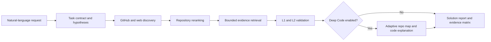

# RepoScoutAgent

[简体中文](README.md) | [English](README.en.md)

RepoScoutAgent discovers and compares open-source solutions using verifiable repository evidence.
It combines L1 documentation matching, L2 static implementation signals, optional Deep Code
understanding, GitHub plus SearXNG discovery, evidence matrices, and persistent research snapshots.
Candidate repository code is never executed.

Users describe a goal in natural language instead of writing GitHub search syntax. RepoScout turns
the request into atomic, repository-verifiable criteria and complementary search hypotheses. It
searches GitHub and optional SearXNG results, reads repository evidence, validates exact quotes, and
returns complete solution proposals rather than an unqualified list of repository names.

## Key Capabilities

- Natural-language task contracts with deterministic timeout fallback.
- Multiple complementary GitHub queries instead of one all-keyword `AND` query.
- GitHub discovery with optional self-hosted SearXNG web recall.
- README, docs, releases, key issues, recent commits, manifests, and bounded source retrieval.
- Requirement-by-requirement `satisfied`, `violated`, and `unknown` evidence.
- L2 `implemented`, `documented_only`, `uncertain`, and `contradicted` static signals.
- Core-purpose validation to reject repositories that only happen to contain matching words.
- Near-match results when no repository satisfies every hard constraint.
- Multi-component solutions with primary, mobile sync, object storage, and reverse proxy roles.
- Evidence matrices and SQLite research-task persistence.
- Explicit `auto`, `new`, and `refine` conversation context modes.
- Optional Deep Code mode for repository-level code comprehension.

## Evidence Levels

### L1: Documentation evidence

RepoScout retrieves repository-owned documentation and validates every quote against its source
path and commit SHA. Repository content is always treated as untrusted input.

### L2: Static implementation evidence

L2 answers whether a specific requested capability has a verifiable static implementation signal.
Manifests alone are weak evidence and cannot establish `implemented`. RepoScout does not import or
execute candidate code.

### Deep Code: What the code does

Deep Code is separate from L2. It explains the repository's overall responsibilities, entry
points, modules, and major data flows. It is disabled by default, so normal searches do not pay its
latency cost. When enabled, it analyzes at most the top three final candidates.

The inspection budget adapts to repository size and reputation:

| Repository profile | Strategy | Maximum files |
|---|---|---:|
| Established, high-reputation | Documentation-first minimal code map | 6 |
| Small or unknown | Broad static reading | 24 |
| Medium | Targeted entries and core modules | 12 |
| Large | Repo map and core slices | 7 |

Files over 200 KB and vendor, generated, test, fixture, distribution, and dependency directories
are skipped. Truncated trees, invalid content, model timeout, and partial candidate failures are
reported as limitations. Model-generated module evidence is retained only when the exact quote is
present in the referenced source file.

## Search Flow



The discovery stage keeps a broad product-category query and adds one-facet queries for important
capabilities. Optional deployment wording such as Docker therefore cannot eliminate otherwise
strong projects before evidence validation. Similarity reference names such as "similar to
RepoScout" are removed from executable queries; the system searches the product category instead.

## Quick Start

```powershell
python -m venv .venv
.\.venv\Scripts\Activate.ps1
python -m pip install -r requirements/dev.txt
Copy-Item .env.example .env
.\.venv\Scripts\python.exe main.py --port 8000
```

Open `http://127.0.0.1:8000`. Runtime parameters are documented by:

```powershell
.\.venv\Scripts\python.exe main.py --help
```

Host, port, GitHub concurrency/retry budgets, web-search budgets, requirement timeout, and the
SearXNG URL are command-line options rather than environment variables.

## Docker and Free Web Search

```powershell
Copy-Item .env.example .env
.\.venv\Scripts\python.exe docker_cli.py up --build
.\.venv\Scripts\python.exe docker_cli.py status
```

No proxy is required when Docker Hub is directly reachable. If a pull fails with
`failed to fetch oauth token`, poisoned DNS, or a connection timeout, apply a proxy only to that
command instead of storing a machine-local port in `.env`:

```powershell
.\.venv\Scripts\python.exe docker_cli.py up --build --proxy http://127.0.0.1:7897
.\.venv\Scripts\python.exe docker_cli.py --help
```

The option temporarily supplies `HTTP_PROXY`, `HTTPS_PROXY`, and `NO_PROXY` to Docker CLI and
BuildKit. It does not modify the current shell, system environment, or project `.env`. Native
`docker compose` commands remain supported.

Compose starts RepoScout and an internal SearXNG service. No paid web-search key is required. If
SearXNG is not configured for a direct process launch, RepoScout continues with GitHub-only
discovery.

For a separately managed SearXNG instance:

```powershell
.\.venv\Scripts\python.exe main.py --searxng-url http://127.0.0.1:8080
```

## Configuration

Copy `.env.example` and configure secrets and model/provider selection:

```text
OPENAI_API_KEY=...
OPENAI_BASE_URL=https://api.openai.com/v1
OPENAI_MODEL=gpt-4.1-mini
OPENAI_EMBEDDING_MODEL=text-embedding-3-small
OPENAI_ASSESSMENT_MODEL=gpt-5.4-mini
OPENAI_ANALYSIS_TIMEOUT=60
GITHUB_TOKEN=...
ANALYSIS_MAX_CONCURRENCY=8
ANALYSIS_CANDIDATE_LIMIT=8
REPOSCOUT_RETRIEVAL_MODE=hybrid
```

`REPOSCOUT_RETRIEVAL_MODE` accepts `hybrid`, `semantic`, or `full`; `semantic` and `full` are
primarily useful for evaluation and ablation.

## API

Standard search:

```http
POST /api/search
Content-Type: application/json

{"requirement":"Find a self-hosted photo system with face recognition","deep_code_search":false}
```

Streaming search uses the same request body:

```http
POST /api/search/stream
```

Conversation behavior can be selected with `context_mode`: `auto`, `new`, or `refine`.

Research snapshots:

```http
GET /api/research
GET /api/research/{research_id}
```

Standalone Deep Code tool:

```http
POST /api/tools/deep-code-search
Content-Type: application/json

{"repository":"owner/repository","requirement":"Explain its modules and data flow"}
```

## Quality Checks

```powershell
.\.venv\Scripts\python.exe -m ruff check .
.\.venv\Scripts\python.exe -m mypy src main.py
.\.venv\Scripts\python.exe -m pytest
```

Tests use mocked provider responses and do not require live OpenAI or GitHub access.

## Limitations and Safety Boundary

- L1 documentation claims do not prove runtime correctness.
- L2 and Deep Code are static analyses with different purposes; neither executes candidate code.
- L3 build and L4 runtime verification remain outside the product safety boundary.
- GitHub recursive trees may be truncated for very large repositories; results expose this state.
- Deep Code currently uses Python AST plus cross-language static symbol patterns, bounded file
  selection, and a validated model explanation rather than a persistent full-repository index.
- Conversation context is bounded in-process memory and is cleared on restart.
- SearXNG discovery was not part of every historical performance observation; each benchmark
  records whether it was enabled.

## Project Layout

```text
src/reposcout/       graph, retrieval, evidence, search integration, and code understanding
tests/               unit, graph, API, and evaluation regression tests
evals/               offline datasets and replay tools
static/              web interface
searxng/             self-hosted search configuration
docs/                performance history and milestones
main.py              FastAPI application and CLI
```

See [TODO.en.md](TODO.en.md) for the roadmap, [evals/README.md](evals/README.md) for offline
evaluation, and [docs/PERFORMANCE_HISTORY.en.md](docs/PERFORMANCE_HISTORY.en.md) for the public performance
engineering history.
