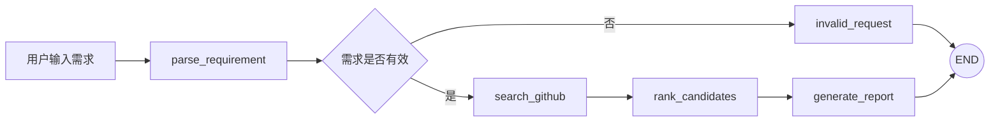
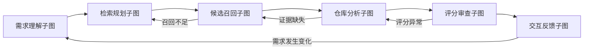
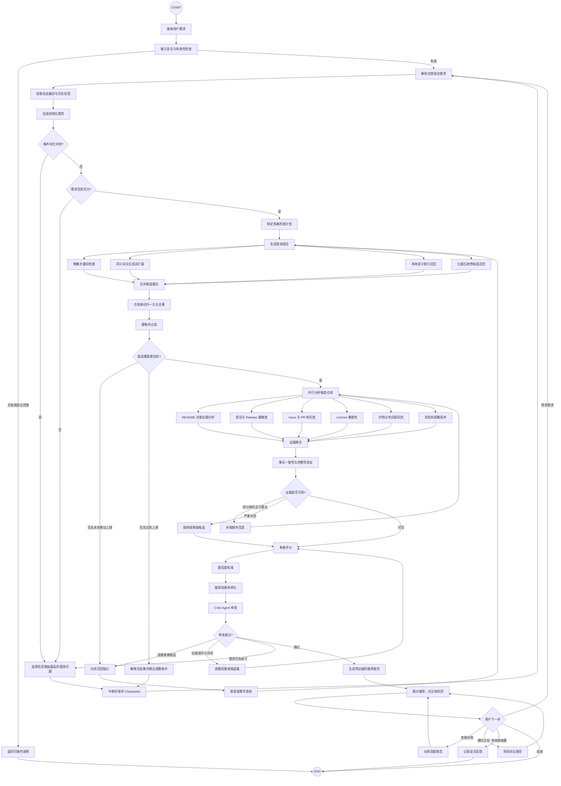
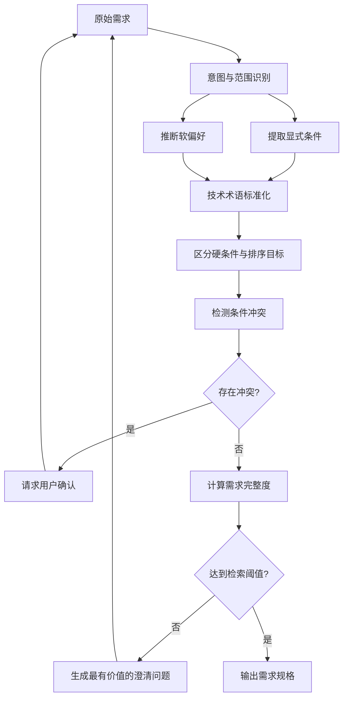
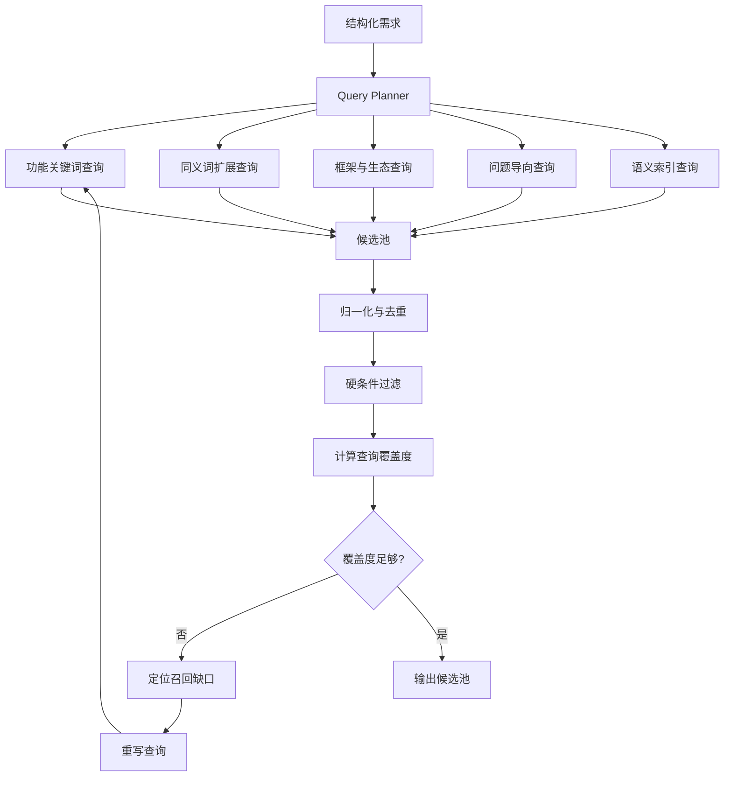
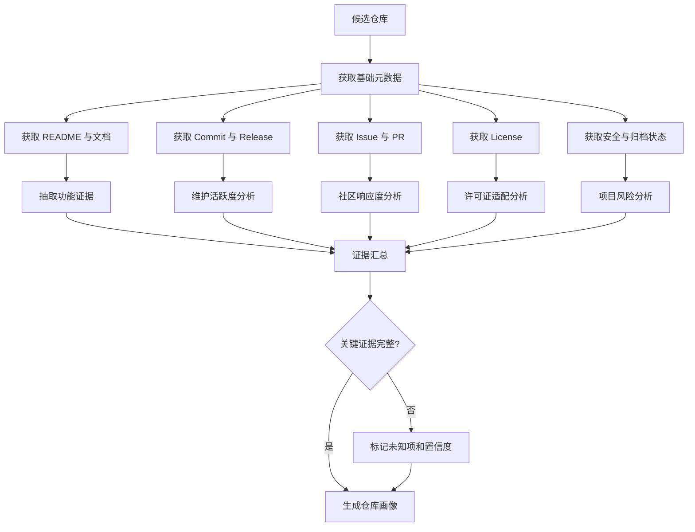
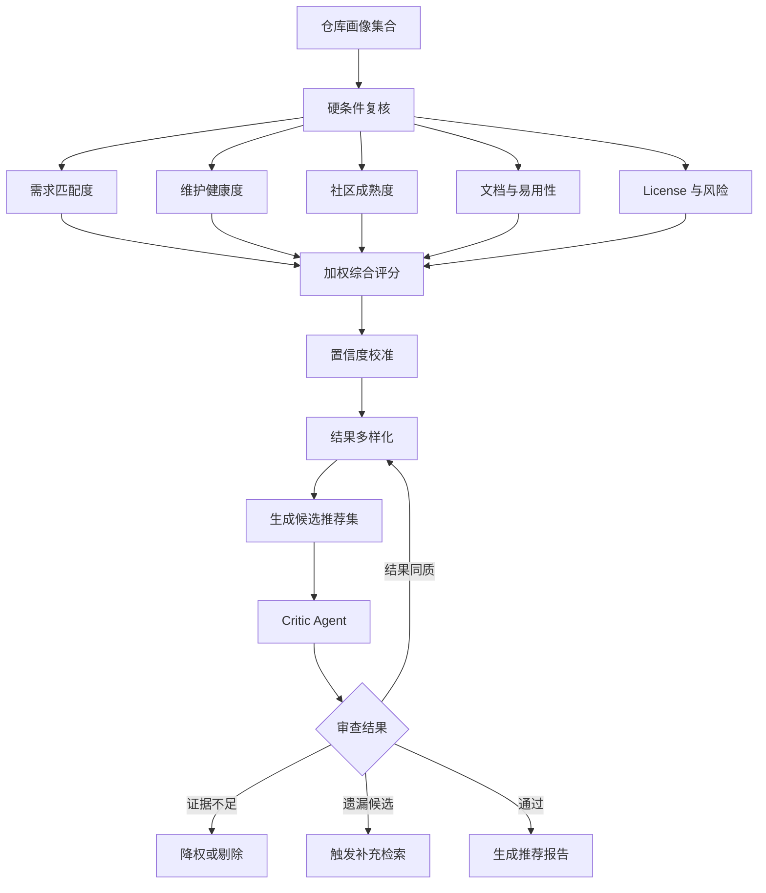
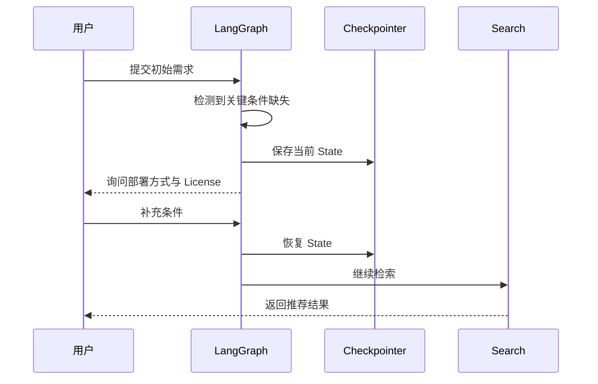

# RepoScout

RepoScout 是一个用 LangGraph 构建的 GitHub 项目推荐 Agent。

你只需要用日常语言描述自己想找什么，例如“适合初学者的 Python Agent 项目”或“支持本地部署的知识库系统”。RepoScout 会自动理解需求、搜索 GitHub、筛选候选项目，并说明每个项目为什么值得推荐、有哪些不足。

它希望解决一个简单但常见的问题：当你知道自己想做什么，却不知道应该在 GitHub 上搜索哪些关键词时，依然能够找到合适、可靠且仍在维护的开源项目。

> 当前仓库处于 MVP 阶段。代码已经实现最小可执行闭环；本文后半部分描述的是后续要逐步实现的完整架构，不代表所有节点均已完成。

## 为什么做 RepoScout

GitHub Search 擅长关键词匹配，但开发者的需求通常不是关键词：

> 我想找一个适合 Agent 开发实习学习的 Python 项目，最好使用 LangGraph，有工具调用和人工审核，不要太复杂，最近半年仍在维护。

普通搜索存在几个问题：

- 用户不知道项目使用的准确术语，难以构造检索语句。
- Star 高不代表项目适合当前用户。
- 名字匹配的仓库可能已经归档或停止维护。
- 搜索结果缺少功能证据、维护风险和横向比较。
- 同质项目会挤占前排结果，无法覆盖“轻量、成熟、易扩展”等不同选择。

RepoScout 的目标不是替代 GitHub，而是在 GitHub Search 之上增加需求理解、证据分析、质量判断和可解释推荐。

## 当前最小可执行版本

MVP 已实现以下闭环：



当前能力：

- 使用 LangGraph 编排节点和条件边。
- 从自然语言中提取语言、主题、最低 Star、活跃时间等基本条件。
- 生成 GitHub Search 查询并调用公开 REST API。
- GitHub Token 可选；未配置时使用匿名 API 配额。
- 按文本匹配、Star、更新时间和归档状态进行可解释评分。
- 展示推荐理由、风险、License、更新时间和项目链接。
- GitHub API 失败或限流时返回明确错误，不伪造推荐结果。
- 提供 Web 界面和 JSON API。

当前刻意没有实现：

- LLM 驱动的复杂需求解析。
- README、Issue、Release、贡献者和安全信息的深度分析。
- 并行检索、持久化 Checkpoint、人工中断恢复。
- Embedding、向量数据库和个性化推荐。
- 完整的评测与可观测性体系。

这些能力会按本文的完整 Graph 逐步补齐。

## 快速启动

### 1. 安装依赖

```powershell
python -m venv .venv
.\.venv\Scripts\Activate.ps1
pip install -r requirements.txt
```

### 2. 配置环境变量

复制 `.env.example` 为 `.env`。最小版本不强制要求 OpenAI Key；建议配置 GitHub Token 来提高 API 限额。

```dotenv
GITHUB_TOKEN=github_pat_xxx
OPENAI_API_KEY=sk-xxx
OPENAI_BASE_URL=https://api.openai.com/v1
OPENAI_MODEL=gpt-4.1-mini
```

`.env` 已被 `.gitignore` 排除，不应提交任何 Token。

### 3. 运行

```powershell
.\.venv\Scripts\python.exe main.py
```

访问 <http://127.0.0.1:8000>。

健康检查：

```text
GET /api/health
```

搜索接口：

```text
POST /api/search
Content-Type: application/json

{
  "requirement": "我想找适合学习的 Python LangGraph Agent 项目，至少 20 stars"
}
```

## 项目结构

```text
.
├── main.py                    # 最小 HTTP 服务
├── src/
│   └── reposcout/
│       ├── graph.py           # LangGraph 构建与条件路由
│       ├── nodes.py           # MVP 节点实现
│       ├── github_client.py   # GitHub Search API 客户端
│       └── state.py           # Graph State 类型
├── static/
│   └── index.html             # 最小可用搜索界面
├── tests/
│   └── test_graph.py          # 不访问网络的核心流程测试
├── .env.example
└── requirements.txt
```

## 完整系统流程

完整版本使用一个主 Graph 组织六个可独立演进的子图：



### 主 Graph



## 子图设计

### 1. 需求理解子图



结构化需求区分三种约束：

| 类型 | 示例 | 处理方式 |
|---|---|---|
| 硬条件 | Python、必须自托管、MIT License | 不满足则过滤 |
| 软偏好 | 文档完善、社区活跃、部署简单 | 参与评分 |
| 排序目标 | 更适合入门、更成熟、更易扩展 | 决定权重和结果角色 |

需求示例：

```json
{
  "goal": "寻找适合 Agent 开发实习学习的项目",
  "topics": ["agent", "langgraph", "tool-calling"],
  "languages": ["Python"],
  "required_features": ["graph workflow"],
  "preferred_features": ["human-in-the-loop", "tests"],
  "excluded": ["archived", "course-only"],
  "license_allowlist": ["MIT", "Apache-2.0"],
  "minimum_stars": 20,
  "active_within_days": 180,
  "difficulty": "beginner_to_intermediate"
}
```

### 2. 检索规划与候选召回子图



搜索循环必须有明确上限，例如最多三轮，并记录每一轮：

- 查询表达式和生成原因。
- 返回数量、去重后数量、过滤原因。
- GitHub API 配额和错误。
- 本轮对需求字段的覆盖情况。

### 3. 单仓库分析子图

每个候选仓库通过 LangGraph Send API 并行进入分析子图：



模型结论必须附带可追溯证据，而不能只保留布尔值：

```json
{
  "claim": "支持 Docker Compose 部署",
  "value": true,
  "source": "README.md",
  "evidence": "docker compose up -d",
  "source_url": "https://github.com/example/repo#deployment",
  "confidence": 0.96
}
```

### 4. 评分、校准与审查子图



初始评分模型保持可解释：

```text
总分 =
    需求匹配度 × 40%
  + 维护健康度 × 20%
  + 社区成熟度 × 15%
  + 文档质量 × 10%
  + 部署适配度 × 10%
  + License 适配度 × 5%
  - 风险惩罚
```

最终结果不只取总分前五，而是提供不同角色：

- 综合最佳。
- 最适合入门。
- 最成熟。
- 最轻量。
- 最适合二次开发。

## Graph State

完整版本计划使用以下共享状态：

```python
class RecommendationState(TypedDict):
    session_id: str
    messages: list
    raw_requirement: str

    requirement: dict
    requirement_completeness: float
    clarification_questions: list[str]
    user_preferences: dict

    search_plan: dict
    search_queries: list[dict]
    search_round: int
    api_budget: dict

    raw_candidates: list[dict]
    filtered_candidates: list[dict]
    rejected_candidates: list[dict]

    repository_profiles: list[dict]
    evidence: dict[str, list[dict]]
    scores: dict[str, dict]

    recommendations: list[dict]
    critic_result: dict
    final_report: str

    errors: list[dict]
    next_action: str
```

State 只保存可序列化数据，不保存 API Client、数据库连接或不可重放的运行时对象。

## 条件路由

完整 Graph 至少包含以下路由函数：

| 路由 | 可能目标 |
|---|---|
| `route_input` | `reject` / `parse_requirement` |
| `route_completeness` | `ask_clarification` / `build_search_plan` |
| `route_search_result` | `analyze_candidates` / `rewrite_queries` / `no_result` |
| `route_evidence` | `score_candidates` / `refetch_repository` / `drop_candidate` |
| `route_critic` | `generate_report` / `rerank` / `supplementary_search` / `ask_clarification` |
| `route_feedback` | `finish` / `parse_requirement` / `compare_repositories` / `repository_detail` |

所有循环都必须同时具备：

- 最大重试次数。
- 终止原因。
- API 和 Token 预算。
- 可观测的状态变化。
- 失败后的用户可操作提示。

## 人工中断与恢复

需求冲突或信息不足时，不让模型擅自决定关键条件，而是使用 LangGraph `interrupt`：



开发期使用 SQLite Checkpointer，部署时迁移到 PostgreSQL。

## 可靠性约束

### 防止幻觉

- 仓库名称、URL、Star、License 等事实只能来自 GitHub API。
- 功能判断必须引用 README 或仓库文档证据。
- 无法确认的信息标记为“未知”，不让模型补全。
- 最终报告中的每项关键结论关联 `source_url`。
- Critic 只审查已有证据，不负责创造新事实。

### API 限流

- 优先使用 ETag 和条件请求。
- 搜索结果、README 和仓库画像分层缓存。
- 记录 `X-RateLimit-Remaining` 和重置时间。
- 并发分析使用有界队列。
- 接近配额时减少补充查询，而不是静默失败。

### 安全

- 所有 Token 只从环境变量读取。
- 对用户输入和 GitHub 内容进行提示注入隔离。
- README 被视为不可信数据，不允许改变系统指令。
- 限制可抓取文件的类型、大小和域名。
- 日志中移除 Token、Authorization Header 和敏感查询。

## 评测计划

项目不会只用“看起来推荐得不错”作为验收标准。计划建立一套人工标注查询集：

```text
query
expected_constraints
must_include_repositories
must_exclude_repositories
acceptable_recommendations
reasoning_requirements
```

核心指标：

| 指标 | 说明 |
|---|---|
| Constraint Accuracy | 是否正确提取硬条件 |
| Precision@K | 前 K 个结果中相关项目比例 |
| Constraint Violation Rate | 推荐结果违反硬条件的比例 |
| Evidence Coverage | 推荐理由中有证据支持的比例 |
| Stale Repository Rate | 推荐归档或长期不维护项目的比例 |
| Recommendation Diversity | 前 K 个项目的能力和定位差异 |
| Clarification Efficiency | 达到可检索状态需要的追问次数 |
| Cost per Query | 单次推荐的 API 与模型成本 |
| End-to-End Latency | 从请求到首屏结果的时间 |

评测分三层：

1. 节点单元测试：需求解析、过滤、评分和路由。
2. 固定数据回放：使用保存的 GitHub 响应，保证结果可重复。
3. 在线端到端评测：使用有限 API 配额验证真实数据变化。

## 可观测性

每次运行记录：

- Graph 运行 ID 与 Checkpoint ID。
- 节点输入输出摘要和执行时间。
- 条件边选择及原因。
- GitHub 请求次数、缓存命中率和剩余额度。
- 模型名称、Token 使用量和结构化输出失败次数。
- 候选项目被过滤、降权和剔除的原因。
- 最终推荐与用户反馈。

开发阶段可接入 LangSmith；系统仍保留结构化本地日志，避免核心调试能力依赖外部平台。

## 开发路线

### Milestone 0：最小闭环

- [x] LangGraph 基础状态与节点。
- [x] GitHub Search API。
- [x] 基础需求解析、评分和报告。
- [x] Web 界面。
- [x] 离线单元测试。

### Milestone 1：可信推荐

- [ ] OpenAI 结构化需求解析。
- [ ] 多查询规划与并行召回。
- [ ] README 功能证据抽取。
- [ ] License、归档和活跃度硬过滤。
- [ ] 搜索缓存与 GitHub 限流处理。

### Milestone 2：完整 Agent 工作流

- [ ] 子图拆分和 Send API 并行分析。
- [ ] Critic Agent 和补充检索循环。
- [ ] `interrupt` 澄清与 Checkpointer。
- [ ] 项目详情和横向对比。
- [ ] 用户反馈驱动重新排序。

### Milestone 3：工程化与评测

- [ ] 人工标注评测集。
- [ ] 自动回归评测。
- [ ] LangSmith Trace 和成本统计。
- [ ] PostgreSQL 持久化。
- [ ] Docker、CI 和在线部署。

## 设计原则

1. **证据优先**：推荐理由必须能追溯到 GitHub 数据。
2. **规则约束模型**：硬过滤和事实字段不交给 LLM 猜测。
3. **渐进式复杂度**：只有分支、循环或恢复需求真实存在时才增加节点。
4. **失败可见**：限流、缺失和不确定性显式展示。
5. **人类掌握关键决策**：需求冲突时询问用户，不擅自放宽硬条件。
6. **可评测**：每个节点都有稳定输入输出，支持离线回放。

## License

本项目用于学习和作品集展示，License 将在首个稳定版本前确定。
