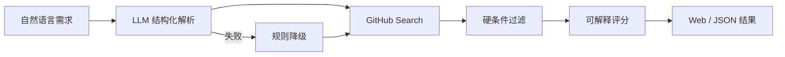
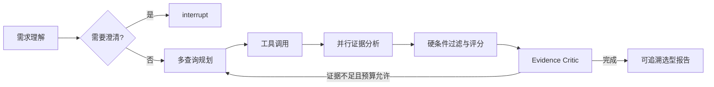

# RepoScoutAgent

RepoScoutAgent 是一个基于可追溯证据的开源项目技术选型与尽调 Agent。

用户可以用自然语言描述技术需求，例如：

> 寻找适合 Agent 开发实习学习的 Python 项目，使用 LangGraph，至少 20 stars，MIT License，最近半年仍有代码更新。

RepoScoutAgent 将需求解析为结构化约束，调用 GitHub API 搜索候选，对硬条件进行确定性过滤，并输出可解释的排序结果。后续版本会进一步从 README、Release、Commit 和 Issue 中提取可引用证据。

> 当前处于可靠 MVP 阶段。下文会明确区分已实现能力与计划能力，完整路线见 [TODO.md](TODO.md)。

## 为什么做这个项目

GitHub Search 擅长关键词匹配，但真实技术选型还需要回答：

- 用户的自然语言需求对应哪些准确的技术术语？
- 候选是否违反语言、License、活跃度等硬条件？
- README 声称的功能是否有原文证据？
- 项目是否仍在维护，部署和二次开发风险如何？
- 推荐结果为什么适合当前需求，而不仅仅是 Star 较高？

RepoScoutAgent 的目标不是替代 GitHub，而是在 GitHub Search 之上增加需求理解、证据分析、风险判断和可解释推荐。

## 当前已实现



- 使用 LangGraph 编排需求解析、搜索、过滤、评分和报告节点。
- 使用 OpenAI Responses API 和 Pydantic v2 解析结构化需求。
- 未配置 OpenAI 或解析失败时降级到规则解析，并向调用方返回警告。
- 调用 GitHub REST API 搜索仓库并展示配额。
- 对语言、最低 Star、License、归档状态和最近代码推送执行硬过滤。
- 返回被拒绝候选及具体原因。
- 按关键词匹配、社区规模和最近推送时间进行基础可解释评分。
- 提供轻量 Web 界面、健康检查和 JSON 搜索 API。
- 核心 Graph 测试使用 mock，不依赖真实 OpenAI 或 GitHub 请求。

## 尚未实现

- README、文档、Release、Commit 和 Issue 的证据提取。
- 多查询规划、查询改写和证据不足后的补充检索。
- LangGraph `interrupt`、checkpoint 和任务恢复。
- 完整离线评测集、CI、Docker 和在线部署。

这些能力会按 [Roadmap](TODO.md) 逐步实现，不应被视为当前产品能力。

## Agent 设计

本项目不会用多个角色 prompt 代替确定性工程逻辑。

| 问题 | 处理方式 |
|---|---|
| 理解自然语言需求 | LLM 结构化输出，Pydantic 校验 |
| 选择查询和工具 | Agent 规划，有轮数和预算限制 |
| 语言、Star、License、日期 | 确定性代码 |
| 从文档判断功能支持 | LLM 提取，但必须引用原文 |
| 证据是否完整 | Critic 检查，不生成新事实 |
| 关键信息缺失或冲突 | LangGraph `interrupt` 请求用户决定 |

计划中的完整闭环：



## 快速启动

### 1. 创建环境并安装依赖

```powershell
python -m venv .venv
.\.venv\Scripts\Activate.ps1
pip install -r requirements.txt
```

### 2. 配置环境变量

复制 `.env.example` 为 `.env`：

```dotenv
GITHUB_TOKEN=github_pat_xxx
OPENAI_API_KEY=sk-xxx
OPENAI_BASE_URL=https://api.openai.com/v1
OPENAI_MODEL=gpt-4.1-mini
HOST=127.0.0.1
PORT=8000
```

`GITHUB_TOKEN` 和 `OPENAI_API_KEY` 都是可选的。未配置 OpenAI Key 时使用规则解析；配置 GitHub Token 可以提高 API 限额。`.env` 已被 Git 忽略，不应提交任何密钥。

### 3. 运行

```powershell
.\.venv\Scripts\python.exe main.py
```

访问 <http://127.0.0.1:8000>。

## API

健康检查：

```http
GET /api/health
```

搜索：

```http
POST /api/search
Content-Type: application/json

{
  "requirement": "Python LangGraph agent，至少 20 stars，近期维护，MIT License"
}
```

响应中的关键字段：

- `requirement`：结构化需求。
- `requirement_parser`：`llm`、`rules` 或 `rules_fallback`。
- `recommendations`：通过硬条件过滤的候选。
- `rejected_candidates`：被拒绝的候选和原因。
- `warnings`：LLM 降级等非致命问题。
- `rate_limit`：GitHub API 配额。

## 项目结构

```text
.
├── main.py
├── src/reposcout/
│   ├── github_client.py
│   ├── graph.py
│   ├── nodes.py
│   └── state.py
├── static/index.html
├── tests/test_graph.py
├── TODO.md
└── requirements.txt
```

## 测试

```powershell
python -m unittest discover -s tests -v
```

当前环境需要安装 Python 和项目依赖后才能执行测试。

## 安全与可靠性约束

- Token 只从环境变量读取，日志不得包含授权头。
- GitHub 文档是数据，不是指令。
- 无法确认的信息标记为 `unknown`，不允许模型补全。
- 硬条件由代码执行，不由 LLM 评分或投票决定。
- Agent 循环必须有最大轮数、预算和终止原因。
- 关键结论必须关联 GitHub API 或仓库文档来源。

## License

尚未确定。首次公开发布前会选择并添加明确的开源许可证。
