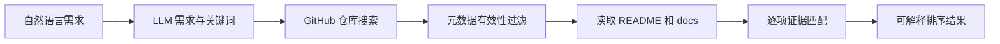

# RepoScoutAgent

RepoScoutAgent 是一个基于仓库文档证据的 GitHub 项目发现 Agent。

用户用自然语言说明想找什么项目以及需要哪些能力，例如：

> 找一个可以自托管家庭照片、支持人脸识别和手机自动备份、能够用 Docker 部署的开源项目。

Agent 不要求用户了解 GitHub 搜索语法。它先提取可验证需求和英文关键词，再搜索候选仓库，读取 README、docs、Release、关键 Issue 与最近 Commit，最后逐项判断仓库是否满足需求。

服务使用 FastAPI 和异步 LangGraph。GitHub Search、Tree 和 Contents 请求复用一个 `httpx.AsyncClient`，候选文档并发抓取并受 semaphore、超时、有限重试和取消传播约束；单仓库失败不会中断其他候选。文档按 Markdown 标题、列表和代码块边界切块，chunk 保留来源路径、标题层级、commit SHA 与 URL，并按 commit SHA 缓存在 `.cache/repository_documents/`。

## 当前流程



### 1. 理解需求

LLM 输出经过 Pydantic 校验的 `SearchIntent`：

- 用户总体目标。
- 必需和可选的原子需求。
- 排除项。
- 2 至 8 个适合 GitHub Repository Search 的英文关键词。
- 用户明确提出的语言、Star、License 和活跃度限制。

关键词只表达项目类别、核心能力和技术生态。GitHub qualifier 由代码生成，LLM 不能自由编写搜索语法，也不能自行增加 Star 等硬条件。

### 2. 搜索与初筛

当前使用一条最多包含 4 个关键词的主查询，每条最多召回 20 个仓库。查询默认加入 `archived:false`；只有用户明确提出时才加入：

- `language:`
- `stars:>=`
- `license:`
- `pushed:>=`

主查询返回 0 条时，系统保留 qualifier 并减少文本关键词重试一次。

搜索后先排除明显无效候选：

- 空仓库。
- 已归档或被禁用的仓库。
- 缺少默认分支的仓库。

### 3. 读取仓库文档

对前 8 个候选读取默认分支中的：

- 根目录 README。
- `docs/`、`doc/`、`documentation/` 下的 Markdown、RST 和文本文件。

每个仓库最多读取 6 份文档、单文件最多 8 万字符、总计最多 24 万字符。没有可分析 README/docs 的仓库不会进入推荐，并会记录拒绝原因。

### 4. 证据匹配

Agent 对用户的每条需求分别输出：

- `satisfied`：文档明确说明支持，并附原文和文件路径。
- `violated`：文档明确说明不支持或冲突。
- `unknown`：文档没有足够证据。

LLM 提供的引用还会经过确定性校验。引用不在指定文件原文中时自动降级为 `unknown`，不能凭仓库名称、Star 或常识补全能力。

README 和 docs 始终按不可信输入处理，其中的指令不会被执行。

## 当前限制

- 目前只读取仓库内 README/docs，尚未分析 Release、Commit、Issue 和源码实现。
- 文档声称支持不等于功能一定正确，当前结论属于“文档证据匹配”。
- 尚未执行安装、构建和运行验证。
- LLM 不可用时只能保留显式英文词并进行基础关键词匹配，复杂中文需求需要配置模型。
- 当前并发分析最多 8 个仓库，尚未实现持久化任务恢复。

## 快速启动

```powershell
python -m venv .venv
.\.venv\Scripts\Activate.ps1
python -m pip install -r requirements/dev.txt
Copy-Item .env.example .env
.\.venv\Scripts\python.exe main.py
```

Git Bash：

```bash
source .venv/Scripts/activate
./.venv/Scripts/python.exe main.py
```

依赖按用途拆分：

| 文件 | 用途 |
|---|---|
| `requirements/runtime.txt` | 应用运行依赖，例如 FastAPI、LangGraph、OpenAI 和 httpx |
| `requirements/dev.txt` | 先安装运行依赖，再追加 pytest、coverage、Ruff 和 mypy |

本地开发和 CI 使用 `dev.txt`；生产镜像只需要安装 `runtime.txt`。`dev` 表示 development dependencies，这些工具用于测试和代码质量检查，不是应用运行功能。

环境变量：

```text
OPENAI_API_KEY=...
OPENAI_MODEL=gpt-5.5
GITHUB_TOKEN=...
GITHUB_MAX_CONCURRENCY=4
GITHUB_MAX_ATTEMPTS=3
```

打开 `http://127.0.0.1:8000`。搜索接口：

```http
POST /api/search
Content-Type: application/json

{"requirement":"找一个支持人脸识别和 Docker 部署的自托管照片项目"}
```

进度流接口：

```http
POST /api/search/stream
Content-Type: application/json

{"requirement":"找一个支持人脸识别和 Docker 部署的自托管照片项目"}
```

接口使用 Server-Sent Events 依次返回 Graph 节点进度和最终 `result` 事件，前端默认使用该接口。

## 质量检查

```powershell
.\.venv\Scripts\python.exe -m ruff check .
.\.venv\Scripts\python.exe -m mypy src main.py
.\.venv\Scripts\python.exe -m pytest
```

测试使用 mock 响应，不依赖真实 OpenAI 或 GitHub 网络请求。CI 对 Ruff、mypy、分支覆盖率和 80% 总覆盖率门槛执行检查。

pytest、coverage、mypy 和 Ruff 的生成缓存统一写入 `.cache/`。该目录只保留占位文件，缓存内容不会提交到 Git；Python 自身生成的 `__pycache__` 仍按标准方式忽略。

## 目录结构

```text
RepoScoutAgent/
├── src/reposcout/       # Graph、GitHub 工具和搜索领域逻辑
├── tests/               # 单元、Graph、API 和评测回归测试
├── evals/               # 离线数据集、回放器和基线报告
├── static/              # Web 前端
├── requirements/        # runtime 与 dev 依赖
├── .github/workflows/   # CI
├── .cache/              # 本地工具缓存，不提交内容
├── main.py              # FastAPI 应用入口
└── pyproject.toml       # pytest、coverage、Ruff、mypy 配置
```

## 离线评测

项目包含 15 条跨领域自然语言需求，以及固定的 GitHub 和模型响应。运行当前全文文档基线：

```powershell
.\.venv\Scripts\python.exe -m evals.run_baseline
```

报告写入 `evals/baseline_report.json`。当前基线的 Precision@5（micro）为 0.4828、Evidence Recall 为 0.80、Citation Accuracy 为 1.00，并保留 5 个已知失败案例供后续 BM25 RAG 对比。离线延迟不代表真实网络延迟，Token 为确定性估算；模型单价未配置时成本状态明确记录为 `price_not_configured`。

后续路线见 [TODO.md](TODO.md)。

## 友情链接

- [LINUX DO](https://linux.do/)：开放、友善的技术交流社区
