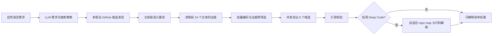

# RepoScoutAgent

[简体中文](README.md) | [English](README.en.md)

RepoScoutAgent 是一个基于可校验证据的开源方案发现与比较工具。
当前提供 L1 文档证据匹配、L2 静态实现验证和用户可选的 Deep Code 代码理解；项目不执行候选仓库代码。

用户用自然语言说明想找什么项目以及需要哪些能力，例如：

> 找一个可以自托管家庭照片、支持人脸识别和手机自动备份、能够用 Docker 部署的开源项目。

用户不需要了解 GitHub 搜索语法。系统先提取可验证需求，再由 LLM 设计具有独立搜索假设的结构化策略，搜索候选仓库，读取 README、docs、Release、关键 Issue 与最近 Commit，最后把仓库作为组件组织为包含适用场景、能力覆盖、缺口和落地步骤的候选方案。

网页搜索采用 provider 接口。Compose 默认使用自托管 SearXNG；未配置 SearXNG 时继续
使用 GitHub-only。网页结果只用于发现仓库，候选仍需经过 GitHub API 补全和仓库原始证据验证。
最终输出包含“需求 × 方案”证据矩阵，并将完整研究快照持久化到
`.cache/research_tasks.db`。

多组件需求会拆成核心项目、移动端同步、对象存储和反向代理等独立角色并行召回。
组合只在双方文档存在 WebDAV、S3、HTTP/TLS 等共享接口时标记为
`interface_verified`；若核心项目文档明确点名 PhotoSync、MinIO、Caddy、Traefik 或
Nginx，则标记为 `documented_by_primary`，表示仍需对配套方做端到端验证。

网页以多轮对话驱动同一个 Agent。协作模式默认先展示通俗的目标和逐项验证条件，等待用户
“确认并继续”、输入自然语言修改，或跳过后续确认。搜索完成后仍可继续补充或覆盖条件。
会话、消息、待确认 checkpoint 和研究结果统一保存在 `.cache/research_tasks.db`，服务或容器
重启后可以从历史会话恢复。Compose 的 `reposcout-cache` 卷会持久化该目录。

前端展示的是可审计的 Graph 阶段、状态、候选摘要和节点耗时，统称“执行过程”或“决策轨迹”；
它不是也不会保存模型的私有思维链。数据库不保存 API Key。

上下文模式支持 `auto`、`new` 和 `refine`。`auto` 只在“改成、再加、不要、优先、instead”等
明显补充表达或回答澄清问题时继承当前任务；完整的新目标默认替换当前任务。API 可在
`context_mode` 字段显式指定行为，网页输入框上方也提供“新任务”和“补充条件”切换。

服务使用 FastAPI 和异步 LangGraph。GitHub Search、Tree 和 Contents 请求复用一个 `httpx.AsyncClient`，候选文档并发抓取并受 semaphore、超时、有限重试和取消传播约束；单仓库失败不会中断其他候选。文档按 Markdown 标题、列表和代码块边界切块，chunk 保留来源路径、标题层级、commit SHA 与 URL，并按 commit SHA 缓存在 `.cache/repository_documents/`。

## 当前流程



### 1. 理解需求

LLM 输出经过 Pydantic 校验的 `SearchIntent`：

- 用户总体目标。
- 针对本次请求即兴生成的成功标准，不套用固定任务类型。
- 排除项。
- 每项成功标准需要的证据来源和证据检索术语。
- 3 至 6 条开放命名的互补搜索假设、预期信号及其验证的成功标准。
- 2 至 8 个英文关键词备用集，仅在 LLM 策略不可用时用于规则降级。
- 用户明确提出的语言、Star、License 和活跃度限制。

策略不再限制为类别、替代品等固定枚举。LLM 可以根据“学习代表性实现”“选择生产依赖”“寻找某种源码参考”等具体请求即兴设计角度，但不能把推测偏好升级为用户未表达的硬条件。每个搜索假设必须说明为什么可能找到合适项目、预期看到什么可观察信号，以及它服务于哪些成功标准。GitHub qualifier 仍由代码生成，LLM 不能自由编写搜索语法，也不能自行增加 Star 等硬条件。

### 2. 搜索与初筛

当前由 LLM 生成最多 6 条互补搜索策略；代码清洗每条的 1 至 3 个术语，加入确定性 qualifier 并编译为 GitHub 查询。查询并发执行后按仓库全名去重，最多保留 60 个候选。查询默认加入 `archived:false`；只有用户明确提出时才加入：

搜索结果会记录命中的查询指纹、策略视角和最佳查询位置。同一个仓库被多个独立假设发现，是重排时的一个可解释信号。

LLM 不可用时，系统才使用关键词确定性组合，并将查询明确标记为 `rules_fallback`。

- `language:`
- `stars:>=`
- `license:`
- `pushed:>=`

每条查询返回 0 条时，系统保留 qualifier 并减少文本关键词重试一次。单条查询失败不会丢弃其他查询结果。

多条件需求不会被编译成单一的全词 AND 查询。搜索计划固定保留一条产品类别宽召回，
再按单项能力生成 facet 查询，并与 LLM 的互补搜索假设合并；Docker、手机备份等能力
在候选召回后通过仓库证据逐项验证。若没有仓库满足全部硬条件，系统会返回明确标记为
`near_miss` 的最接近候选及冲突项，而不是给出空结果或把部分满足伪装成全满足。

搜索后先排除明显无效候选：

- 空仓库。
- 已归档或被禁用的仓库。
- 缺少默认分支的仓库。

剩余最多 60 个候选不会再按 GitHub 合并顺序直接截断。系统用完整任务契约（目标、成功标准和搜索假设）与仓库名称、描述、topics、语言做 embedding 语义重排，再结合假设覆盖、元数据完整度和活跃度，选出前 24 个进入文档与源码读取。Star 不参与默认重排；只有用户明确要求 Star 下限时才作为 GitHub 硬过滤。embedding 失败时使用可解释的确定性特征降级。

### 3. 读取仓库文档

对前 24 个候选读取默认分支中的：

- 根目录 README。
- `docs/`、`doc/`、`documentation/` 下的 Markdown、RST 和文本文件。
- `package.json`、`pyproject.toml`、`requirements*.txt`、`Cargo.toml` 和 `go.mod` 等 manifest。
- 与需求术语或 `auth/config/route/schema/service` 路径相关的有界源码文件。

每个仓库最多读取 6 份文档和 10 份静态实现文件，单文件最多 8 万字符、总计最多 24 万字符。`tests`、`fixtures`、`vendor`、`generated`、`dist` 和 `node_modules` 等路径不作为 L2 实现证据。没有可分析 README/docs 的仓库不会进入推荐，并会记录拒绝原因。

读取后使用需求证据覆盖、仓库语义分数、实现文件信号和搜索假设多样性做廉价预筛选，默认选择 8 个候选进入强模型判断，其中保留探索名额，避免全部集中于同一种检索路线。

### 4. 证据匹配

系统为每条原子需求生成多个语义视角，同时执行 BM25 稀疏召回和多查询向量召回，用加权 RRF 融合排名后再用 MMR 去除重复证据，最后输出：

- `satisfied`：文档明确说明支持，并附原文和文件路径。
- `violated`：文档明确说明不支持或冲突。
- `unknown`：文档没有足够证据。

LLM 提供的引用还会经过确定性校验。引用不在指定文件原文中时自动降级为 `unknown`，不能凭仓库名称、Star 或常识补全能力。

README 和 docs 始终按不可信输入处理，其中的指令不会被执行。

### 5. L2 静态实现验证

L2 将文档声称与实现迹象分开输出：

- `implemented`：相关源码、路由、配置或 Schema 中存在可校验原文。
- `documented_only`：文档声称支持，但没有召回到静态实现证据。
- `uncertain`：只有依赖名、文件名或其他弱信号。
- `contradicted`：静态实现原文明确与文档声称冲突。

静态文件先按白名单、路径术语重合和结构性文件名评分。manifest 使用 Python 标准库 JSON/TOML 解析器提取依赖信号。向量编码包含文件类型、路径、标题、解析信号和原文；其排名与 BM25 通过 RRF 融合，再使用 MMR 保留多样化静态证据。

manifest 依赖名只是弱证据，不能单独得到 `implemented`。所有静态结论都必须通过原文、文件路径和 commit SHA 校验。

## 当前限制

- L1 仍以 README/docs 为主证据，Release、Issue 和最近 Commit 只作补充信息。
- L2 只验证静态实现迹象；可选 Deep Code 解释代码职责，但两者都不证明运行时行为正确。
- 尚未执行安装、构建和运行验证。
- 验证上限为 L2 静态实现迹象；L3 构建和 L4 运行验证明确不进入产品范围。
- Docker 部署只构建 RepoScout 自身，不会构建或启动搜索到的候选仓库。
- LLM 不可用时使用中英领域短语和显式英文词降级；未覆盖领域的复杂中文需求仍建议配置模型。
- 当前读取重排后的 24 个仓库，默认对预筛选后的 8 个执行强模型判断。
- SQLite 支持单实例重启恢复；当前未提供多实例共享写入和用户身份隔离。

## 快速启动

```powershell
python -m venv .venv
.\.venv\Scripts\Activate.ps1
python -m pip install -r requirements/dev.txt
Copy-Item .env.example .env
.\.venv\Scripts\python.exe main.py
```

服务地址和 GitHub 请求策略使用命令行参数配置：

```powershell
.\.venv\Scripts\python.exe main.py --port 8080 --github-max-concurrency 6
.\.venv\Scripts\python.exe main.py --help
```

Git Bash：

```bash
source .venv/Scripts/activate
./.venv/Scripts/python.exe main.py
```

## Docker 启动

先从模板创建 `.env` 并填写至少 `OPENAI_API_KEY` 和建议配置的 `GITHUB_TOKEN`：

```powershell
Copy-Item .env.example .env
.\.venv\Scripts\python.exe docker_cli.py up --build
.\.venv\Scripts\python.exe docker_cli.py status
```

Docker Hub 可以直连时不需要代理。如果拉取镜像出现 `failed to fetch oauth token`、DNS 污染或
连接超时，只为本次命令指定代理，不要把本机端口写入 `.env`：

```powershell
.\.venv\Scripts\python.exe docker_cli.py up --build --proxy http://127.0.0.1:7897
.\.venv\Scripts\python.exe docker_cli.py --help
```

该参数临时设置 Docker CLI 和 BuildKit 使用的 `HTTP_PROXY`、`HTTPS_PROXY` 与
`NO_PROXY`，命令结束后不会修改当前 PowerShell、系统环境或项目 `.env`。也可以继续直接
使用原生 `docker compose` 命令。

打开 `http://127.0.0.1:8000`。Compose 会同时启动只在容器网络内可见的 SearXNG，
因此网页召回不要求付费 API Key，搜索使用 SearXNG + GitHub。容器以非 root 用户运行，
`/api/health` 用于健康检查，文档缓存保存在 `reposcout-cache` 卷中。

研究任务接口：

```http
GET /api/research
GET /api/research/{research_id}
POST /api/research/{research_id}/resume
```

会话历史接口：

```http
GET /api/conversations
GET /api/conversations/{conversation_id}
DELETE /api/conversations/{conversation_id}
```

代码理解工具：

```http
POST /api/tools/deep-code-search
Content-Type: application/json

{"repository":"owner/repository","requirement":"解释这个仓库的主要模块和数据流"}
```

搜索页的 `Deep Code` 开关默认关闭。关闭时不增加任何代码理解节点；开启后只对最终前
3 个候选建立 repo map、读取入口和核心模块，并输出带源码原文的整体职责解释。它与 L2
严格分开：L2 回答“某项需求是否有静态实现迹象”，Deep Code 回答“这份代码整体在做
什么”，两者都不会执行不可信仓库代码。

Deep Code 使用自适应预算：成熟高信誉项目做文档优先和最小结构核对；小型仓库最多广泛
读取 24 个代码文件；中型仓库定向读取 12 个；大型仓库降级为 7 个入口/核心切片和符号
地图。单文件超过 200 KB、vendor/generated/tests、无效内容会跳过；GitHub 文件树截断、
模型超时或部分候选失败会明确记录限制并返回其余结果。

列表接口返回研究编号、原始查询、创建时间和方案数量；详情接口恢复当时的方案、证据矩阵、查询计划和引用快照。

停止服务使用 `python docker_cli.py down`；只有在确认不再需要文档缓存时才直接使用
`docker compose down -v`。
项目 CI 会在每次 push 和 pull request 中构建生产镜像。

依赖按用途拆分：

| 文件 | 用途 |
|---|---|
| `requirements/runtime.txt` | 应用运行依赖，例如 FastAPI、LangGraph、OpenAI 和 httpx |
| `requirements/dev.txt` | 先安装运行依赖，再追加 pytest、coverage、Ruff 和 mypy |

本地开发和 CI 使用 `dev.txt`；生产镜像只需要安装 `runtime.txt`。`dev` 表示 development dependencies，这些工具用于测试和代码质量检查，不是应用运行功能。

环境变量：

```text
OPENAI_API_KEY=...
OPENAI_MODEL=gpt-5.5
OPENAI_ASSESSMENT_MODEL=gpt-5.4-mini
OPENAI_ANALYSIS_TIMEOUT=60
GITHUB_TOKEN=...
ANALYSIS_MAX_CONCURRENCY=8
ANALYSIS_CANDIDATE_LIMIT=8
REPOSCOUT_RETRIEVAL_MODE=hybrid
```

`HOST`、`PORT`、`GITHUB_MAX_CONCURRENCY` 和 `GITHUB_MAX_ATTEMPTS` 不再从环境变量读取，
分别使用 `--host`、`--port`、`--github-max-concurrency` 和
`--github-max-attempts`；运行 `python main.py --help` 可查看默认值和完整说明。
网页召回的查询数、单次结果数和总时间预算分别由 `--web-search-max-queries`、
`--web-search-results` 和 `--web-search-timeout` 控制。默认只并行执行 2 条网页查询，
网页分支最多占用 4 秒；超时或 API 失败时立即保留 GitHub 原生结果继续执行。
`--searxng-url http://127.0.0.1:8080` 可连接独立运行的免费 SearXNG。未配置时自动保持
GitHub-only，不影响仓库原生搜索。
任务契约的 LLM 解析预算由 `--requirement-timeout` 控制，默认 60 秒。搜索 API 默认使用
完整模式：解析超时或失败时明确停止，不会静默改成关键词查询。只有请求显式传入
`allow_requirement_fallback=true`（或前端开启“快速降级”）时，才使用中英领域短语和
显式英文词继续搜索，并在结果中标明降级。没有配置 `OPENAI_API_KEY` 时同样遵守该策略：
完整模式明确提示配置模型，不会静默使用规则解析。

`REPOSCOUT_RETRIEVAL_MODE` 可设为 `hybrid`、`semantic` 或 `full`，默认使用
`hybrid`。`semantic` 只用于纯向量消融对照；`full` 用于完整文档基线。
embedding 模型由 `OPENAI_EMBEDDING_MODEL` 配置（默认 `text-embedding-3-small`）。
embedding 输入会跨仓库批量编码，并在进程内按模型和内容 hash 缓存。如果当前模型服务不提供 embedding，首次失败后该轮会熔断到 BM25 Top-K，不再逐仓库重试失败的 embedding，也不会把整份文档直接塞给模型。
候选仓库的证据检索和 LLM 判断默认以 8 个有界并发通道执行，可通过
`ANALYSIS_MAX_CONCURRENCY` 调整，上限为 8。提高并发会降低总时长，但也会增加模型
服务的瞬时请求压力。
`OPENAI_ASSESSMENT_MODEL` 可使用较快的结构化输出模型，任务契约仍使用 `OPENAI_MODEL`。单仓库判断超过 `OPENAI_ANALYSIS_TIMEOUT` 后会降级为规则判断，避免一个异常慢请求拖住整轮。

打开 `http://127.0.0.1:8000`。搜索接口：

```http
POST /api/search
Content-Type: application/json

{"requirement":"找一个支持人脸识别和 Docker 部署的自托管照片项目","interactive":true}
```

进度流接口：

```http
POST /api/search/stream
Content-Type: application/json

{"requirement":"找一个支持人脸识别和 Docker 部署的自托管照片项目"}
```

接口使用 Server-Sent Events 依次返回 Graph 节点进度和最终 `result` 事件，前端默认使用该接口。
当协作模式返回 `interaction.status=pending` 时，研究任务处于可恢复状态。向
`/api/research/{research_id}/resume` 提交 `{"action":"confirm"}`、
`{"action":"edit","feedback":"..."}` 或 `{"action":"skip"}` 即可继续。

## 质量检查

```powershell
.\.venv\Scripts\python.exe -m ruff check .
.\.venv\Scripts\python.exe -m mypy src main.py
.\.venv\Scripts\python.exe -m pytest
```

测试使用 mock 响应，不依赖真实 OpenAI 或 GitHub 网络请求。CI 对 Ruff、mypy、分支覆盖率和 80% 总覆盖率门槛执行检查。

pytest、coverage、mypy 和 Ruff 的生成缓存统一写入 `.cache/`。该目录只保留占位文件，缓存内容不会提交到 Git；Python 自身生成的 `__pycache__` 仍按标准方式忽略。

## 目录结构

```text
RepoScoutAgent/
├── src/reposcout/       # Graph、检索、证据判断和 GitHub 领域逻辑
├── tests/               # 单元、Graph、API 和评测回归测试
├── evals/               # 离线数据集、回放器和基线报告
├── static/              # Web 前端
├── requirements/        # runtime 与 dev 依赖
├── .github/workflows/   # CI
├── .cache/              # 本地工具缓存，不提交内容
├── main.py              # FastAPI 应用入口
└── pyproject.toml       # pytest、coverage、Ruff、mypy 配置
```

## 离线评测

项目包含 15 条跨领域自然语言需求，以及固定的 GitHub 和模型响应。运行当前全文文档基线：

```powershell
.\.venv\Scripts\python.exe -m evals.run_baseline
```

报告写入 `evals/baseline_report.json`。当前基线的 Precision@5（micro）为 0.4828、Evidence Recall 为 0.80、Citation Accuracy 为 1.00，并保留 5 个已知失败案例供后续检索改进对比。离线延迟不代表真实网络延迟，Token 为确定性估算；模型单价未配置时成本状态明确记录为 `price_not_configured`。

混合 RRF + MMR 评测可通过 `.\.venv\Scripts\python.exe -m evals.run_rag` 运行，报告写入 `evals/rag_report.json`。
检索专项消融评测可通过 `.\.venv\Scripts\python.exe -m evals.run_retrieval` 运行，对比 lexical-only、dense-only 和 hybrid 的 Recall@1/MRR。

L2 静态证据门槛评测：

```powershell
.\.venv\Scripts\python.exe -m evals.run_l2
```

当前固定集的 L2 Precision 为 `1.00`、`documented_only` 检出率为 `1.00`、错误 `implemented` 推断率为 `0.00`。该固定集用于校验安全门槛，不代表对公开 GitHub 仓库的泛化质量。

性能优化的历史记录、真实前后对照和测量边界见
[docs/PERFORMANCE_HISTORY.md](docs/PERFORMANCE_HISTORY.md)。该文档作为公开工程档案保留，后续优化追加或修订，不删除旧基线。
下一阶段的性能 Milestone、建议 Issues 和质量门槛见
[docs/PERFORMANCE_MILESTONE.md](docs/PERFORMANCE_MILESTONE.md)。

后续路线见 [TODO.md](TODO.md)。

## 友情链接

- [LINUX DO](https://linux.do/)：开放、友善的技术交流社区
