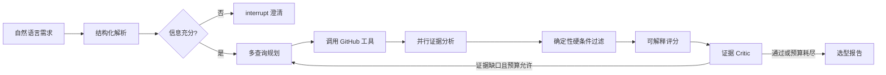

# RepoScoutAgent Roadmap

> 产品定位：基于可追溯证据的开源项目技术选型与尽调 Agent。

## 开发原则

1. LLM 负责理解、规划和证据归纳；事实字段和硬条件由确定性代码处理。
2. 每条关键结论必须关联 GitHub API 数据或仓库文档证据。
3. Agent 循环必须有轮数、Token、API 调用次数和耗时上限。
4. 先用评测证明效果，再引入向量数据库、多 Agent 或分布式任务队列。
5. README、TODO 和实际代码必须保持一致，未集成的能力不得标记完成。

## Agent 核心

RepoScoutAgent 不是“LLM 包装搜索接口”。最终 Agent 闭环如下：

Agent 能力体现在：

- 根据需求选择查询策略和 GitHub 工具，而不是固定调用链。
- 根据召回覆盖度改写查询，最多三轮。
- 证据不足时触发一次补充检索，而不是让模型补全事实。
- 需求冲突或关键信息缺失时通过 LangGraph `interrupt` 请求用户决定。
- 保存可恢复状态、工具轨迹、预算和终止原因。

## Milestone 0：可靠 MVP

目标：保证当前最小闭环真实、确定、可测试。

- [x] 使用 LangGraph 建立最小工作流
- [x] 接入 GitHub Repository Search API
- [x] 提供 Web 界面和 JSON API
- [x] 使用 Pydantic v2 定义 `RepositoryRequirement`
- [x] 使用 OpenAI Responses API 解析结构化需求
- [x] OpenAI 不可用时降级为规则解析并返回可见警告
- [x] 支持可选 `GITHUB_TOKEN` 并展示 API 配额
- [x] 对语言、最低 Star、License、归档和最近推送执行硬过滤
- [x] 返回被拒绝仓库及拒绝原因
- [x] 核心 Graph 使用离线 mock 测试
- [ ] 为 GitHub 403、429、超时和畸形响应补充测试
- [ ] 为中文、英文和中英混合需求增加参数化测试
- [ ] 增加 Ruff、mypy 和 pytest-cov，核心模块覆盖率达到 80%
- [ ] 配置 GitHub Actions 执行 lint、type check 和 test

完成定义：

- 测试不访问 OpenAI 或 GitHub 网络。
- 违反硬条件的仓库不可能进入推荐结果。
- LLM 降级、GitHub 限流和部分数据缺失对用户可见。

## Milestone 1：证据尽调闭环

目标：推荐理由来自真实仓库内容，并且可以复核。

### GitHub 工具

- [ ] 定义统一的 `RepositorySummary` Pydantic 模型
- [ ] 实现 `get_repository`
- [ ] 实现 `get_readme`
- [ ] 实现 `get_recent_commits`
- [ ] 实现 `get_releases`
- [ ] 实现 Issue/PR 活跃度摘要
- [ ] 使用共享 `httpx.AsyncClient` 和有界并发
- [ ] 对网络错误、服务端错误和限流实施分类重试
- [ ] 支持 ETag 条件请求和分层 TTL 缓存

### 证据模型

- [ ] 定义 `Evidence`：claim、value、quote、source_url、commit_sha、confidence
- [ ] 按 Markdown 标题切分 README 和 `docs/` 文档
- [ ] 第一版使用 BM25/关键词检索证据片段
- [ ] README 内容始终作为不可信数据，不得改变系统指令
- [ ] 限制抓取域名、文件类型、文件大小和总内容预算
- [ ] 对每项需求输出 `satisfied / violated / unknown`
- [ ] 为功能、部署、维护、文档、License 和风险生成 `RepositoryProfile`
- [ ] 最终报告中的每条关键结论附来源链接

完成定义：

- 仓库名称、Star、License、归档状态等事实只来自 GitHub API。
- 无证据时返回 `unknown`，不允许 LLM 猜测。
- 单个仓库抓取失败不会导致整次任务失败。

## Milestone 2：完整 Agent 工作流

目标：证明系统具备有边界的自主规划、工具使用和恢复能力。

- [ ] 定义 `SearchPlan`、`SearchStep`、`TaskBudget` 和 `TerminationReason`
- [ ] LLM 生成多路 GitHub 查询并由 Pydantic 校验
- [ ] 对相同工具和参数去重
- [ ] 根据需求字段计算召回覆盖度
- [ ] 覆盖不足时改写查询，最多三轮
- [ ] 使用 LangGraph `Send` 并行分析候选仓库
- [ ] 使用 semaphore 控制 GitHub 并发和二级限流
- [ ] Critic 只检查约束和证据完整性，不创造新事实
- [ ] Critic 可触发最多一次补充检索
- [ ] 使用 LangGraph `interrupt` 处理需求冲突和关键字段缺失
- [ ] 使用 SQLite checkpointer 支持中断和恢复
- [ ] 保存节点耗时、工具调用、Token、API 配额和终止原因
- [ ] 支持查看仓库详情和两个仓库的横向对比

完成定义：

- 每个循环都有明确预算和退出条件。
- Agent 决策轨迹可观察、可回放、可测试。
- 硬条件、事实字段和最终分数不由多个 Agent 投票决定。

## Milestone 3：评测与产品交付

目标：用数据证明质量，并交付可在线体验的作品。

- [ ] 建立 30 至 50 条人工标注查询
- [ ] 保存固定 GitHub 响应，支持完全离线回放
- [ ] 评测 Constraint Accuracy
- [ ] 评测 Precision@5 和 Constraint Violation Rate
- [ ] 评测 Evidence Coverage 和 Stale Repository Rate
- [ ] 记录端到端延迟、Token、API 调用次数和单次成本
- [ ] 对规则解析、单查询、多查询和补充检索做消融实验
- [ ] 实现 FastAPI Pydantic 请求和响应模型
- [ ] 提供 SSE 或 WebSocket 任务进度事件
- [ ] 增加 Dockerfile 和一键启动配置
- [ ] 部署在线 Demo
- [ ] 提供架构图、评测报告和两分钟演示视频
- [ ] 编写至少两份 ADR，说明关键技术取舍

## 暂缓项及启用条件

以下能力不是为了“少做”，而是等待明确证据后再引入。

| 暂缓能力 | 当前替代方案 | 启用条件 |
|---|---|---|
| Celery + Redis | LangGraph + asyncio 有界并发 | 单任务需要跨进程执行、重启恢复或水平扩展 |
| Chroma/Pinecone | Markdown 切块 + BM25 | 评测显示语义召回能显著提高 Evidence Recall |
| 六个评分 Agent | 确定性特征 + 单一评分器 | 独立 Agent 在盲测中显著优于结构化评分 |
| Agent 辩论/共识 | 规则裁决 + 一个 Critic | 能证明辩论提升准确率且成本可接受 |
| 长期用户画像 | 会话内偏好 | 有登录用户和真实反馈数据 |
| React 重写 | 当前轻量 Web UI | 核心工作流稳定且交互复杂度确实需要 |

## 面试交付清单

- [ ] 一条命令启动项目
- [ ] 在线 Demo 可完成一次端到端选型
- [ ] 展示一次需求澄清和中断恢复
- [ ] 展示一次证据不足后的有界补充检索
- [ ] 展示硬条件过滤和可追溯证据
- [ ] 展示离线评测结果与一次消融实验
- [ ] README 明确区分已实现、正在实现和未来计划

## 当前进度

当前已完成 Milestone 0 的基础闭环，正在补齐可靠性测试和 CI。Milestone 1 至 3 均为计划能力，尚未完成。
