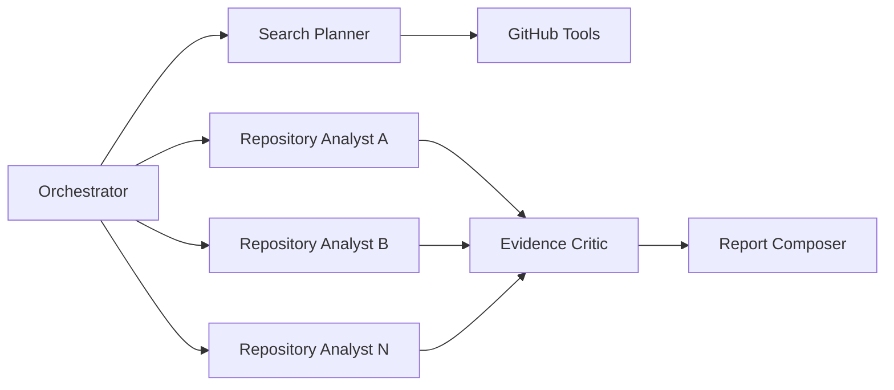

# RepoScoutAgent Roadmap

> 自然语言需求 -> Agent 关键词 -> GitHub 搜索 -> README/docs 证据匹配。

## 产品原则

1. 用户只需描述想找的项目、用途和功能，不需要编写 GitHub 查询。
2. LLM 负责理解需求、生成关键词和归纳文档；查询语法与硬条件由代码控制。
3. 每项“满足需求”的结论必须引用仓库文档原文。
4. 没有证据时返回 `unknown`，不能根据 Star、描述或常识猜测。
5. 仓库文档是不可信输入，必须限制路径、文件类型和内容预算。

## 技术选择门槛

项目按用户结果和评测缺口驱动，不按简历技术名词驱动。任何新组件进入主链路前必须回答：

1. 它解决了哪个已经复现的问题？
2. 当前简单方案为什么不足？
3. 使用哪个离线指标验证收益？
4. 增加了多少延迟、Token、依赖和运维成本？
5. 如果没有收益，能否删除并回到原实现？

| 技术 | 当前决策 | 启用条件 |
|---|---|---|
| FastAPI + asyncio | 下一步必做 | 支持并发抓取、SSE、取消和超时 |
| BM25 | 下一步必做 | 替代整份文档输入并建立 RAG 基线 |
| Embedding | 条件启用 | BM25 在跨语言或同义表达集上召回不足 |
| Hybrid RAG | 条件启用 | BM25 + Embedding 在固定集上有稳定增益 |
| reranker | 条件启用 | 初次召回充分但 Top-K 排序质量不足 |
| 向量数据库 | 暂缓 | 内存索引无法满足持久化、规模或并发需求 |
| LangGraph checkpoint/interrupt | 计划采用 | 任务需要跨请求澄清和重启恢复 |
| LangGraph `Send` 子 Agent | 条件启用 | 候选分析相互独立，且并行显著降低延迟 |
| OpenTelemetry/LangSmith | 条件启用 | 结构化日志不能满足跨节点诊断需求 |
| 模型微调 | 暂缓 | Prompt、规则和 RAG 优化达到瓶颈且有审核数据 |
| Redis/Celery/Kafka | 不计划 | 单机异步与 SQLite 无法满足真实负载时再评估 |
| CrewAI/AutoGen 等第二框架 | 不计划 | LangGraph 已覆盖当前编排需求 |
| GitHub CLI (`gh`) | 可选工具适配器 | 本地深度验证或执行型工作流需要复用开发者身份并操作仓库、PR、Issue、Actions 时启用 |

每次引入条件技术时，PR 必须同时包含基线、实验结果和回滚路径。只完成依赖接入但没有质量或性能证据，不视为里程碑完成。

## Milestone 0：可靠基础

- [x] 自然语言请求校验
- [x] GitHub 搜索及 403、429、超时和异常响应处理
- [x] 语言、Star、License、归档和活跃度确定性约束
- [x] 空仓库、禁用仓库和无默认分支过滤
- [x] 零结果查询自动放宽一次
- [x] Ruff、mypy、pytest-cov 和 GitHub Actions

## Milestone 1：关键词到文档证据

- [x] 定义通用 `SearchIntent` 和原子需求模型
- [x] LLM 生成 2 至 8 个英文 GitHub 搜索关键词
- [x] 防止 LLM 增加用户未提出的硬条件
- [x] 确定性编译 GitHub 查询
- [x] 读取默认分支 README 和 docs 文档
- [x] 限制仓库数、文件数、单文件和总内容预算
- [x] 无 README/docs 的仓库记录为不可分析候选
- [x] 对每条需求输出 `satisfied / violated / unknown`
- [x] 保存证据原文和来源文件
- [x] 校验 LLM 引用确实存在于来源文档
- [x] 按必需需求证据覆盖度排序
- [x] 前端展示关键词、需求和逐项文档证据

完成定义：用户输入任意项目需求后，结果必须来自实际仓库 README/docs；无证据的能力不能显示为满足。

## Milestone 2：评测基线、异步基础与轻量 RAG

目标：先建立可重复基线和可并发的工具层，再从“整份文档直接塞入上下文”升级为可检索的仓库文档 RAG，并排除非空但无效的仓库。

### 2.1 评测基线

- [x] 标注第一批 15 条自然语言需求、相关仓库和关键证据片段
- [x] 固定 GitHub Search、Tree、Contents 和 README/docs 响应
- [x] 实现完全离线的端到端回放
- [x] 记录当前全文输入的 Precision@5、Evidence Recall、Citation Accuracy
- [x] 记录单任务延迟、Token 估算、GitHub/模型调用数和成本配置状态
- [x] 支持按版本化模型输入/输出单价计算估算成本
- [x] 保存至少 5 个当前失败案例，后续技术必须针对这些案例验证

基线产物位于 `evals/baseline_cases.json` 和 `evals/baseline_report.json`。当前全文输入基线：Precision@5（micro）为 0.4828、Evidence Recall 为 0.80、Citation Accuracy 为 1.00；15 条任务共 44 次模型调用、45 次 GitHub 工具调用，估算输入 6476 tokens、输出 2229 tokens。延迟是离线 mock 环境数据，只用于代码回归，不代表线上网络延迟。

### 2.2 FastAPI 与异步工具层

- [x] 用 FastAPI 和 Pydantic 请求/响应模型替换 `http.server`
- [x] GitHub 工具改用共享 `httpx.AsyncClient`
- [x] 使用 semaphore 控制并发和 GitHub 二级限流
- [x] 实现超时、指数退避、有限重试和请求取消
- [x] 单仓库失败不影响其他候选，返回部分成功结果
- [x] 使用 SSE 展示解析、搜索、抓取、分析和汇总进度
- [x] 为后续 LangGraph `Send` 保持工具函数可独立测试

当前 API 同时提供 `POST /api/search` JSON 响应和 `POST /api/search/stream` SSE 进度流。FastAPI lifespan 管理共享 GitHub 客户端；所有请求共用并发限制，连接错误、超时和 5xx 最多重试三次，403/429 不做无意义重试。客户端断开会取消 Graph 和下游异步任务。

### 2.3 文档采集与切块

- [x] 抓取 README、docs、Release、关键 Issue 和最近 Commit
- [x] 按 Markdown 标题、列表和代码块边界切块，不使用固定字符硬切
- [x] 每个 chunk 保存仓库、文件路径、标题层级、commit SHA 和来源 URL
- [x] 对重复、导航、徽章和生成内容去噪
- [x] 限制单文件、单仓库和单任务内容预算
- [x] 缓存文档与 chunk，使用 commit SHA 判断是否失效

文档处理位于 `src/reposcout/documents.py`：优先按 Markdown 结构形成 chunk，超大段落才执行有界拆分；相同正文按内容指纹去重。缓存位于 `.cache/repository_documents/`，同时保存原始来源和 chunk；每次先读取默认分支 Tree 的 commit SHA，SHA 变化后自然使用新的缓存项。Release、Issue 或 Commit 读取失败只缺失对应补充来源，README/docs 主证据链仍可继续。

### 2.4 BM25 RAG 基线

- [ ] 使用 BM25 召回命令名、技术术语和精确功能描述
- [ ] 每条原子需求独立检索，不用一组片段回答所有需求
- [ ] 只把每项需求最相关的少量片段交给 Evidence Analyst
- [ ] 引用必须通过原文、路径和 commit SHA 的确定性校验
- [ ] 比较“整份文档输入”和“BM25 Top-K”的质量、延迟与 Token
- [ ] 仅在 BM25 跨语言召回失败集上评估 Embedding
- [ ] 仅在初次召回充分但排序不足时评估 reranker
- [ ] 只有消融实验通过后才将 Embedding/Hybrid/reranker 接入主链路

第一版只使用进程内 BM25，不引入向量数据库。Embedding、Hybrid RAG 和 reranker 都是待验证假设，不是默认交付项。

### 2.5 无效仓库判断

- [ ] 区分源码仓库、纯文档、模板、Demo、Fork 和 Mirror
- [ ] 检查依赖清单、构建配置、源码比例和项目关键 manifest
- [ ] 根据项目类型检查合理结构，例如 VS Code 扩展的 `package.json/contributes`
- [ ] 分析 Release、Commit 和 Issue 的真实维护活动
- [ ] 识别 README 声明与仓库实现结构的明显矛盾
- [ ] 输出 `valid / invalid / uncertain`，每个结论附原因与证据
- [ ] 可选沙箱任务执行安装或构建，设置网络、时间和资源限制

### 2.6 GitHub CLI 可选执行工具

- [ ] 定义统一 `GitHubTool` 接口，使 REST API 与 `gh` CLI 返回相同的结构化结果和错误类型
- [ ] 默认继续使用 REST API 完成候选搜索、README/docs 采集、并发控制和线上服务调用
- [ ] 检测本机 `gh` 是否安装，并使用 `gh auth status` 判断是否可以复用开发者身份
- [ ] 使用 `gh run`、`gh issue`、`gh pr` 和 `gh release` 深度验证候选仓库的维护状态
- [ ] 用户选中仓库后，可选使用 `gh repo clone` 进入受限沙箱执行安装、构建和测试验证
- [ ] 所有 CLI 调用使用参数数组、命令白名单、超时、输出大小限制和取消传播，禁止拼接执行用户输入
- [ ] 优先使用 `--json` 获取结构化输出；记录命令、退出码、耗时和脱敏后的错误信息
- [ ] `gh` 未安装、未登录或执行失败时明确降级到 REST API，不能影响基础搜索能力
- [ ] 对比 REST 与 CLI 适配器的结果一致性、延迟、部署依赖和故障行为，再决定是否进入默认工作流

该能力用于展示 Agent 调用本地开发工具并从“发现仓库”走向“验证仓库”，不把现有主链路改写成 `gh search` 的封装。服务端和容器部署默认不依赖 GitHub CLI。

完成定义：FastAPI 异步链路可以返回部分成功结果；BM25 相比整份文档输入提高 Evidence Recall 或显著降低 Token 成本；无效仓库判断不依赖单一 Star 或更新时间字段。若 BM25 没有收益，保留全文基线并记录失败结论，不为了完成路线强行接入。

## Milestone 3：Agent、子 Agent 与可恢复执行

目标：展示有边界的自主规划、工具调用、并行任务和故障恢复，而不是用多个 Agent 对事实投票。

### 3.1 LangGraph Agent 循环

- [ ] 定义 `TaskBudget`：查询数、仓库数、API、Token、时间和文档字符上限
- [ ] 定义 `TerminationReason`：完成、无新增候选、证据不足、配额不足和预算耗尽
- [ ] Planner 根据未覆盖的必需需求决定是否补充一次搜索
- [ ] Tool Executor 对相同工具和参数做指纹去重
- [ ] Evidence Critic 只检查需求覆盖、引用有效性和结论一致性
- [ ] Critic 不创造新事实，只能结束或请求针对缺口补充检索
- [ ] 使用 LangGraph `interrupt` 处理关键歧义并恢复原任务
- [ ] 使用 SQLite checkpointer 保存状态，支持进程重启后恢复

### 3.2 多 Agent 与子 Agent



- [ ] Orchestrator 只负责预算、状态、任务分派和终止条件
- [ ] Search Planner 生成关键词和补充查询，不读取全部仓库文档
- [ ] 使用 LangGraph `Send` 为每个候选创建隔离的 Repository Analyst 子任务
- [ ] 子 Agent 独立执行文档检索、需求匹配和仓库有效性判断
- [ ] 子 Agent 返回统一 Pydantic 结果，不直接修改全局排名
- [ ] Evidence Critic 汇总并验证引用，不使用多数投票决定事实
- [ ] Report Composer 只根据已验证结构化结果生成报告
- [ ] 使用 semaphore 限制并发，处理 GitHub 二级限流和重试退避
- [ ] 单个子 Agent 超时或失败不影响其他候选，并在结果中显示失败状态
- [ ] 对比串行、并行子 Agent 的延迟、成本和结果一致性

启用多 Agent 的条件：候选仓库分析彼此独立且并行执行能显著降低延迟。关键词生成、硬条件过滤和最终事实裁决不拆成多个 Agent，避免无意义的角色堆叠。

### 3.3 可观测性与安全

- [ ] 为每次任务生成 trace ID，记录节点耗时、工具调用、重试和预算
- [ ] 记录模型、Prompt、Embedding、索引和数据版本
- [ ] 使用 OpenTelemetry 或兼容追踪后端展示一次完整 Agent trace
- [ ] 对 GitHub 文档实施 Prompt Injection 防护和引用白名单
- [ ] 限制允许访问的域名、文件类型、响应大小和重定向
- [ ] API Key 只从环境变量读取，日志和 trace 自动脱敏

完成定义：能够演示一次证据不足后的有界补充搜索、一次 interrupt 恢复，以及单仓库失败时的部分成功结果。若并行实验达到启用条件，再增加子 Agent 演示；否则保存实验数据并维持单 Agent 异步实现。

## Milestone 4：反馈、评测与产品交付

### 4.1 反馈闭环

- [ ] 前端支持标记需求理解是否正确
- [ ] 支持标记推荐相关/不相关、遗漏仓库和证据判断错误
- [ ] 保存原始需求、关键词、查询、候选、证据、模型版本和反馈
- [ ] 反馈先进入人工审核与离线评测集，不直接用于在线训练
- [ ] 建立 Prompt 和检索策略的版本化回归测试

### 4.2 扩展离线评测

- [ ] 将 Milestone 2 的 15 条基线扩展到 30 至 50 条自然语言需求
- [ ] 保存固定 GitHub 和仓库文档响应用于完全离线回放
- [ ] 评测 Requirement Extraction Accuracy 和 Keyword Recall
- [ ] 评测 Precision@5、Evidence Recall 和 Citation Accuracy
- [ ] 评测 Unsupported Inference Rate 和无效仓库检出率
- [ ] 只对达到启用条件的 BM25、Embedding、Hybrid RAG 做消融实验
- [ ] 对单 Agent、串行子 Agent 和并行子 Agent 做成本与延迟比较
- [ ] 记录端到端延迟、Token、API 调用数和单次成本

只有积累足够人工审核数据，并证明 Prompt、RAG 和规则优化达到瓶颈后，才评估微调需求解析或关键词生成模型；仓库事实仍必须来自实时检索证据。

### 4.3 产品交付

- [ ] 展示仓库详情、文档证据和横向对比
- [ ] 增加 Dockerfile、健康检查和一键启动配置
- [ ] 部署在线 Demo，并设置费用、速率和并发保护
- [ ] README 提供架构图、评测结果、失败案例和成本数据

完成定义：在线 Demo 能稳定完成一次端到端搜索；离线评测可重复运行，并能用数据说明 RAG 和 Agent 循环的收益，以及条件技术被采用或拒绝的原因。

## Agent 开发实习能力映射

| 能力 | 项目中的落点 | 可展示产物 |
|---|---|---|
| Structured Output | `SearchIntent`、证据和预算模型 | Schema 校验与降级测试 |
| Tool Calling | GitHub Search、Tree、Contents、Release、Commit、Issue | 工具错误与重试记录 |
| Local Tool Adapter | 可选 GitHub CLI、结构化输出、REST 降级 | `gh` 深度验证与受限执行 trace |
| RAG | Markdown 切块、BM25；按评测决定 Embedding/rerank | 检索消融实验 |
| Agent Planning | 根据需求覆盖缺口补充搜索 | 有界决策轨迹 |
| LangGraph | 条件分支、`Send`、`interrupt`、checkpoint | 可恢复 Graph Demo |
| Multi-Agent | Orchestrator + Repository Analyst 子任务 + Critic | 并行 trace 与故障隔离 |
| Evaluation | 标注集、离线回放、质量/成本指标 | 可重复评测报告 |
| Observability | trace、Token、API、延迟和终止原因 | 单任务链路视图 |
| Safety | Prompt Injection、防越权抓取、密钥脱敏 | 攻击样例回归测试 |
| Production | 并发控制、缓存、SSE、Docker、CI | 在线 Demo 与运行手册 |

这张表用于说明问题与能力的对应关系，不是必须全部引入的依赖清单。面试展示优先选择已经通过评测证明有效的能力；条件技术若实验无收益，应展示实验结论而不是保留无效实现。

## 实施顺序

```text
固定数据与当前基线
-> FastAPI + 异步 GitHub 工具
-> Markdown 结构化切块
-> BM25 Top-K RAG
-> 仓库有效性判断
-> 可选 GitHub CLI 深度验证
-> checkpoint / interrupt
-> 评估是否需要 Embedding 和 reranker
-> 评估是否需要 Send 子 Agent 并行
-> 扩展反馈、评测和在线交付
```

下一项工作的入口永远是上一阶段的失败案例或性能数据，而不是技术栈列表。

## 当前进度

Milestone 0 和 Milestone 1 的同步闭环已经完成。当前实现属于在线仓库文档 RAG 的基础形态：直接把有界 README/docs 输入模型，尚未切块、建立索引或使用 Embedding。下一步先固定评测基线并改造 FastAPI 异步工具层，然后实现 BM25 RAG；Embedding、reranker 和多 Agent 必须由失败案例及实验数据触发。
