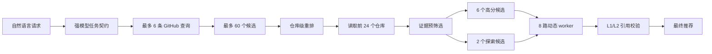
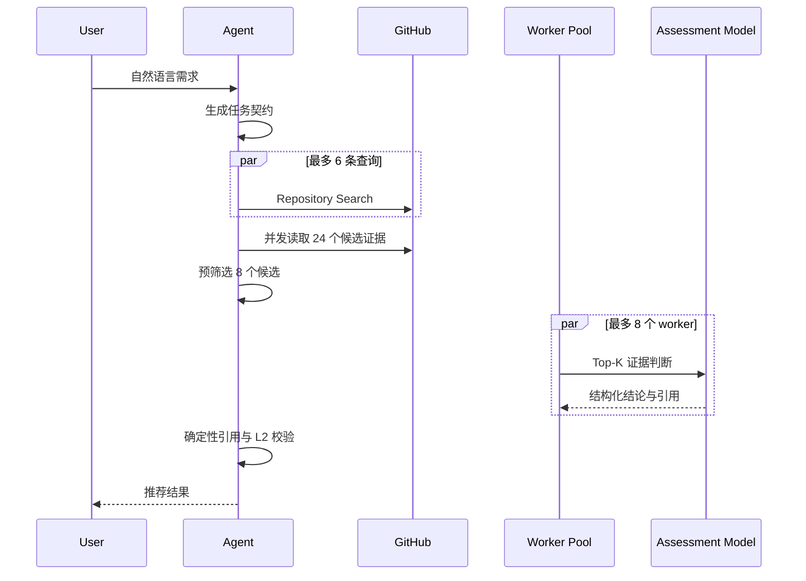

# RepoScoutAgent 性能工程档案

[简体中文](PERFORMANCE_HISTORY.md) | [English](PERFORMANCE_HISTORY.en.md)

> 长期维护约定：本文是项目性能工程的公开历史档案，不应删除。
> 后续优化可以修订解释、补充数据和追加新版本，但必须保留历史基线、测试条件、失败方案与质量护栏，不能只保留最新最好看的数字。

最后更新：2026-07-20

## 一页结论

RepoScoutAgent 的一次宽泛 GitHub 项目检索最初在 300 秒客户端预算内无法完成。通过节点级定位、候选漏斗、有界并行、模型分工、超时隔离和能力熔断，同一真实查询的一次观测从 `>300 秒` 降到 `100.6 秒` 并正常返回结果。按 300 秒保守下界计算，单请求端到端延迟至少降低 `66.5%`，完成速度至少提高 `2.98x`。

这不是严格的 A/B Benchmark：LLM 生成的查询与候选集合没有冻结，GitHub 是实时数据，最终测试可能命中了此前写入的仓库文档缓存，模型服务与网络负载也未固定。因此这组数字是可信的工程观察和优化线索，不能表述为 p50、p95 或吞吐量结论。

离线回归结果保持：

| 指标 | 优化后 |
|---|---:|
| Candidate Recall | 1.00 |
| Recall@24 | 1.00 |
| Recall@analysis | 1.00 |
| Citation Accuracy | 1.00 |
| 自动化测试 | 52 passed |
| 覆盖率 | 87.05% |

这些离线指标来自当前固定夹具，只用于防止已知回归，不代表公开 GitHub 全量数据上的泛化质量。

## 证据状态

### 本次真实测试中实际生效的能力

| 能力 | 已实现 | `100.6 秒`测试中生效 | 说明 |
|---|---:|---:|---|
| `60→24→8` 候选漏斗 | 是 | 是 | 8 个候选进入强模型判断 |
| 8 路动态 worker | 是 | 是 | 替代串行循环和固定分组 |
| 快速证据判断模型 | 是 | 是 | `gpt-5.4-mini` |
| 60 秒单仓库超时 | 是 | 是 | 防止单个请求无限拖延 |
| embedding 批处理 | 是 | 否 | 当前模型服务没有 embedding 模型 |
| embedding 内容缓存 | 是 | 否 | 本次没有成功生成 embedding |
| embedding 能力熔断 | 是 | 是 | 首次失败后停止逐仓库重试 |
| BM25 Top-K 降级 | 是 | 是 | 代替不可用的向量检索 |
| 确定性引用校验 | 是 | 是 | 校验原文、路径和 commit SHA |

因此，不能将 `100.6 秒` 的改善归因于 embedding 批处理或缓存。该次实测的主要有效因素是候选漏斗、动态并发、模型分工、超时隔离和 embedding 失败熔断。

### 当前测试的不可比因素

- 各轮 LLM 可能生成不同的 GitHub 查询。
- GitHub 搜索结果和仓库状态是实时变化的。
- 各轮发现、读取和分析的仓库集合没有冻结。
- `.cache/repository_documents/` 在后期测试中可能已经存在文档缓存。
- 模型服务和网络负载没有固定或记录。
- 当前只保留了单次真实结果，没有足够样本计算 p50/p95。
- 尚未记录各轮 Token、外部调用数量和缓存命中率。

## 优化记录

### 背景

系统需要将自然语言需求转换为多条 GitHub 查询，从最多 60 个仓库中选择候选，读取前 24 个仓库的 README、docs、manifest 和白名单源码，再逐项完成 L1 文档证据和 L2 静态实现验证。

最初实现对最多 24 个仓库串行执行证据检索和 LLM 判断。一次宽泛请求大致包含：

```text
1 次强 LLM 任务契约生成
最多 6 次 GitHub Search
最多 24 个仓库的文档读取
最多约 48 次独立 embedding 请求
最多 24 次串行 LLM 仓库判断
```

真实测试中，查询在 300 秒后仍未返回。页面虽然能展示粗粒度进度，但用户会将长时间等待误认为 GitHub 或服务断连。

### 目标

在不降低证据可信度、不突破 L2 安全边界、不执行候选仓库代码的前提下：

1. 显著缩短端到端搜索时间。
2. 防止单个慢模型请求拖住整轮任务。
3. 减少重复 embedding 和无价值的强模型调用。
4. 保留候选路线多样性，避免只追逐预评分最高的一类项目。
5. 用回归指标证明加速没有直接破坏现有召回和引用正确性。

### 实施

#### 1. 先定位而不是盲目增加并发

通过 SSE 节点进度对真实请求分段观察：

```text
需求理解与查询生成       约 27 秒
GitHub 搜索与仓库重排     约 6 秒
文档读取与证据准备        累计约 54 秒
剩余主要耗时             仓库级 LLM 判断
```

这证明 GitHub 不是主要长尾来源，继续增加 GitHub 并发不会解决核心问题。

#### 2. 构建候选漏斗

保留分层处理：

```text
最多 60 个 GitHub 候选
→ 仓库级重排后读取 24 个
→ 文档证据预筛选后判断 8 个
```

预筛选综合：

- 原子成功标准的术语覆盖率；
- 仓库级语义或确定性重排分数；
- 源码实现文件信号；
- 搜索假设来源多样性。

当前 8 个名额中保留 2 个探索位置，避免 Top-K 全部来自同一种搜索假设。

#### 3. 使用有界动态 worker

将逐仓库串行循环改为共享模型客户端的动态 worker 队列：

- 默认并发上限为 8；
- 一个 worker 只处理一个仓库；
- 单仓库失败不影响其他仓库；
- 快任务完成后立即领取下一个候选，避免固定分组的队头阻塞；
- worker 共享同一任务契约和证据规则，避免重复上下文。

#### 4. 强模型与快速模型分工

- `gpt-5.5`：生成开放式任务契约、成功标准和搜索假设；
- `gpt-5.4-mini`：执行证据受限的结构化仓库判断；
- 确定性代码：验证引用原文、路径、commit SHA 和 L2 证据强度。

模型分工保留了开放式理解能力，同时避免为每个仓库重复调用最慢的强模型。

#### 5. 超时隔离与降级

每个仓库的 LLM 判断设置 60 秒上限。超时后只降级该仓库的判断，不阻塞整轮任务。降级状态会进入 warnings，不能静默伪装成完整模型结论。

#### 6. 批量 embedding 与内容缓存

- 跨仓库收集 chunk 和 requirement query views；
- 按批次调用 embedding 服务；
- 使用 `embedding model + content SHA-256` 作为进程内缓存键；
- 相同内容的后续请求不再重复编码。

#### 7. embedding 能力探测和整轮熔断

当前配置的模型服务没有提供 embedding 模型。旧流程会在仓库重排失败后，对每个仓库继续重复请求 embedding，产生多次 `InternalServerError` 和额外等待。

新流程在仓库级 embedding 首次失败后标记该轮能力不可用：

```text
semantic reranking failed
→ deterministic repository ranking
→ BM25 Top-K evidence retrieval
→ 不再逐仓库重试 embedding
```

降级仍只给模型提供 Top-K 证据，不退回无界完整文档上下文。

#### 8. 质量回归按阶段归因

评测分别计算：

- Candidate Recall；
- Recall@24；
- NDCG@24；
- Recall@analysis；
- 未召回仓库；
- 文档读取前丢失仓库；
- 证据预筛选前后丢失仓库；
- Citation Accuracy。

评测曾错误地将“没有可读取文档而被提前拒绝”的仓库归因于 `24→8` 预筛选。修复后，`Recall@analysis` 的分母只包含成功进入文档候选集的相关仓库，使性能阶段归因与真实处理边界一致。

### 观测结果

使用同一真实请求进行阶段性对照：

```text
我想学习现代 RAG 检索技术，找核心检索实现清晰、有评测代码和架构文档的
Python GitHub 项目；不要只推荐封装型应用。
```

| 版本 | 主要变化 | 单次端到端结果 |
|---|---|---:|
| 原始版本 | 最多 24 个仓库串行判断 | `>300 秒`，客户端超时 |
| 并行初版 | 24→12、4 路固定分组、批量 embedding | 仍 `>300 秒` |
| 快速模型版 | 8 个候选、动态并发、`gpt-5.4-mini` | `161.6 秒` |
| 熔断优化版 | 8 路 worker、60 秒隔离、embedding 整轮熔断 | `100.6 秒`，返回 7 个结果 |

以 300 秒作为原始版本的保守下界：

```text
耗时降低至少：(300 - 100.6) / 300 = 66.5%
速度改善至少：300 / 100.6 = 2.98x
```

由于原始版本实际耗时超过 300 秒，真实改善幅度可能更高，但没有完整结束时间，因此只能使用“至少”表述。

同时，由于缓存状态、查询计划和候选集合没有冻结，这个比例只能作为工程观察，不能解释为 p50、p95 或吞吐量结论。

## 性能架构





## 下一阶段

- 增加调用数、Token 和 trace ID（结构化节点耗时已完成）。
- 建立同一真实请求至少 10 次的 p50/p95 基线。
- 逐仓库流式更新 verified 状态（重排后的暂定候选已可提前展示）。
- 在支持 embedding 的服务上测批量缓存命中率和真实语义重排增益。
- 为多轮对话复用上一轮候选、文档与判断缓存。
- 在质量评测证明安全后，尝试每次 2–3 个仓库的小批量结构化判断。

## 2026-07-20 可观测性与失败快路

本轮是在 `100.6 秒` 单次观察之后追加的工程能力，尚未执行等价的多次真实网络基准，
因此不产生新的延迟数字，也不覆盖前述历史结果。

- LangGraph 各主要节点记录 `duration_ms`，JSON 结果保留完整 `node_timings`，SSE 在节点完成时立即返回该节点耗时。
- `rank_candidates` 完成后，页面先显示前 5 个暂定候选；`prepare_evidence` 完成后显示进入证据验证的候选数。这缩短了感知等待时间，但暂定候选不冒充已验证推荐。
- embedding 首次失败会打开默认 600 秒的跨请求 TTL 熔断。熔断窗口内直接走确定性仓库重排和 BM25 证据检索，避免每轮重复等待已知不可用的 provider；成功调用后自动关闭熔断。
- 熔断只改变不可用能力的失败路径，不缩减候选预算、证据门槛或 L2 校验。相关回归后自动化测试为 `53 passed`，覆盖率 `87.11%`。

对应的后续工作和验收边界见 [`PERFORMANCE_MILESTONE.md`](PERFORMANCE_MILESTONE.md)。

## 2026-07-20 RepoScout 类似项目联网对照

本节是端口 `8000` 上的单次真实网络观察，不是 p50/p95，也不构成统计证明。查询为：

```text
寻找与 RepoScout 类似的开源项目：能够根据自然语言需求发现 GitHub 仓库或开源软件，
支持多源搜索、项目比较、可验证引用或研究报告，并且可以本地部署和实际运行
```

该次环境只启用了 GitHub + 模型路径，没有启用 SearXNG，因此不能据此声称网页召回已在
该样本中生效。

### 修改前

- 研究任务：`0041aec0-e876-4732-954c-f5852b27c03e`
- 端到端：`85.24 s`
- 节点耗时（ms）：validate `0.09`，understand `34325.58`，plan `0.35`，
  GitHub `2734.91`，rank `4948.42`，inspect `21470.15`，
  prepare `110.19`，match `21483.32`，report `0.01`
- 语义重排发生 `InternalServerError`，系统使用确定性排序继续运行。
- 前列结果包含 `Morefixes`、`RepoSwipe` 等只命中局部词语、但产品类别可疑的仓库；
  RepoScout 自身只排第四。原评分对原子条件覆盖奖励过高，没有验证整体核心用途。

### 修改内容

> 历史说明：以下 15 秒超时和自动规则降级描述的是当时的对照版本，不是当前默认行为。
> 当前版本将需求解析预算提高到 60 秒，并默认采用严格模式；只有用户显式开启“快速降级”
> 才允许规则解析。该调整优先保证需求理解质量，因此不能直接复用本节的延迟结论。

- 新增 `--requirement-timeout`，默认 15 秒。任务契约解析超时后走确定性路径，不让单次
  模型请求无限占据关键路径。
- 规则解析新增中英概念映射和原子需求提取。中文请求降级后仍会生成
  `repository discovery`、`multi source search`、`project comparison`、
  `verifiable citations` 等检索词，而不是只剩项目名。
- `RepositoryAssessment` 新增带原文、路径和 commit SHA 的 `core_purpose`。
  明确类别不匹配的仓库被拒绝；证据未知的仓库保留但降权，避免因一个未验证条件
  把潜在好方案全部筛掉；核心用途已验证的结果稳定排在未知结果之前。

### 修改后

- 研究任务：`f3aefa4c-65e8-45b8-b074-6d1cd4708f20`
- 端到端：`76.02 s`，较修改前单次观察减少 `9.22 s`（约 `9.1%`）
- 节点耗时（ms）：validate `0.05`，understand `15006.99`，plan `0.69`，
  GitHub `3203.52`，rank `6210.78`，inspect `29764.18`，
  prepare `267.55`，match `21342.88`，report `0.02`
- 需求解析由 `34.33 s` 限制到 `15.01 s`；本次触发 `TimeoutError` 后成功使用规则契约。
- `ETOLucy/RepoScoutAgent` 以核心用途原文证据排第一，`3em0/reposcan-public`
  被识别为仓库数据集构建工具；`vict0rsch/PaperMemory` 因核心用途不匹配被拒绝。
- 文档读取从 `21.47 s` 上升到 `29.76 s`，说明网络波动和更多有效候选抵消了部分收益。
  下一项时间优化应是文档缓存、固定候选快照和分阶段预算，不应继续压缩证据校验。

另有一次 `3.27 s` 的运行因沙箱网络不可达导致模型与 GitHub 全部快速失败，未保存研究
任务，也未计入前后对照。还有一次旧规则降级样本为 `71.53 s`，但它只召回同名项目，
质量不等价，同样不作为优化结论。

### 相似项目与定位

| 项目 | 本次可验证定位 | 与 RepoScout 的差异 |
|---|---|---|
| `3em0/reposcan-public` | 跨 Git 托管平台构建和扩展仓库数据集 | 偏数据集采集，不是完整的需求验证与方案报告 |
| `Sahil-SS9/GitRadar-Self-Improvement` | 修改前运行的高分候选 | 本次未重新验证其完整能力，不能视为稳定基线 |
| `JafarAkhondali/Morefixes` | 核心用途证据未知 | 局部词命中，当前仍应视为低置信候选而非同类产品 |
| `ETOLucy/RepoScoutAgent` | 自然语言仓库发现和文档证据验证 | 唯一在本次样本中明确覆盖核心产品类别的结果 |

RepoScout 的亮点是把“给出几个名字”扩展成可恢复的研究流程：显式查询计划、GitHub
文档与静态实现两级证据、逐条件引用校验、证据矩阵、研究任务持久化，以及主组件、
手机同步、对象存储和反向代理的兼容性方案。失败隔离和确定性降级使外部服务偶发失败时
仍能给出带风险标记的结果。

主要劣势是总延迟仍高，文档读取和候选判断合计约 51 秒；SearXNG 未启用时，网页召回不是
本次实证；核心用途未知仍可能混入结果；当前没有冻结的同类项目集合、
相关性标注和多次运行统计，无法给出可靠的 Recall/NDCG 与 p95。

### 通用 AI 对照边界

计划的对照是让通用 AI 在“不调用任何外部工具”条件下直接推荐最多 5 个项目。直连调用
被运行环境的数据外发策略拒绝，因此没有生成可比较结果，不能虚构一份答案。方法层面，
通用 AI 的优势是通常能更快产出流畅列表；RepoScout 的可验证优势是引用来自本次仓库
快照、能显示 unknown/violated、能保存任务并组合多个组件。后续应在获准环境中同时测
“无工具通用 AI”和“可联网通用 AI”，记录首字延迟、仓库存在率、核心用途正确率、
引用准确率和结果时效性。

## 2026-07-20 协作式研究会话与中文输出

本次变更以交互完整性和可恢复性为目标，没有建立新的 p50/p95 延迟结论。新增一次真实中文
需求验证：需求模型正常返回中文任务契约，确认后搜索返回 8 套方案；该运行只证明流程可用，
不作为性能统计。

### 新增能力

- 协作模式在任务契约生成后展示通俗目标、必须条件和偏好条件，并暂停等待用户操作。
- 用户可以确认并继续、用自然语言修改理解，或跳过本次确认；确认会复用已有任务契约，
  修改则重新解析并再次进入确认点。
- SQLite 统一保存会话、用户/助手消息、待确认 Graph 状态和完整研究快照；Docker 使用
  `reposcout-cache` 卷持久化数据库，应用容器重启后仍能恢复。
- 新增会话列表、会话详情和研究任务恢复 API。网页“新对话”不再删除旧会话。
- SSE 进度在前端累积为可折叠的执行过程，展示阶段状态与节点耗时；这些是结构化执行轨迹，
  不保存也不展示模型私有思维链。
- 中文或中英混合请求的目标、需求描述、搜索假设、澄清问题、仓库摘要和 Deep Code 解释
  使用简体中文；GitHub 查询词仍可使用英文，避免界面语言约束损害召回。
- 完整搜索默认禁止需求解析静默降级。模型失败或超过 60 秒时明确停止，只有用户主动开启
  “快速降级”才使用确定性关键词规则。

### 验证记录

- 自动化测试：`106 passed`，总覆盖率 `88.47%`。
- Ruff 与 mypy 检查通过。
- Docker 镜像重建成功，RepoScout 与 SearXNG 均通过健康检查。
- 待确认任务在 RepoScout 容器重启后仍保持 `pending`，会话消息和研究编号能够恢复。
- 恢复同一研究任务后返回 8 套方案，研究编号保持不变。
- 真实中文任务契约包含 1 个中文目标和 6 条中文需求描述，`response_language=zh-CN`。

### 性能边界

协作模式会增加一次用户等待，但确认操作不会再次调用需求解析模型。修改操作必须重新解析，
这是纠正任务方向所需的显式成本。SQLite 写入使用线程池隔离同步 I/O，并启用 WAL、外键和
忙等待超时；目前只承诺单实例重启恢复，不声称支持多实例并发写入。
