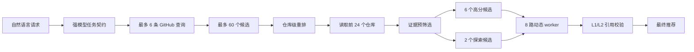
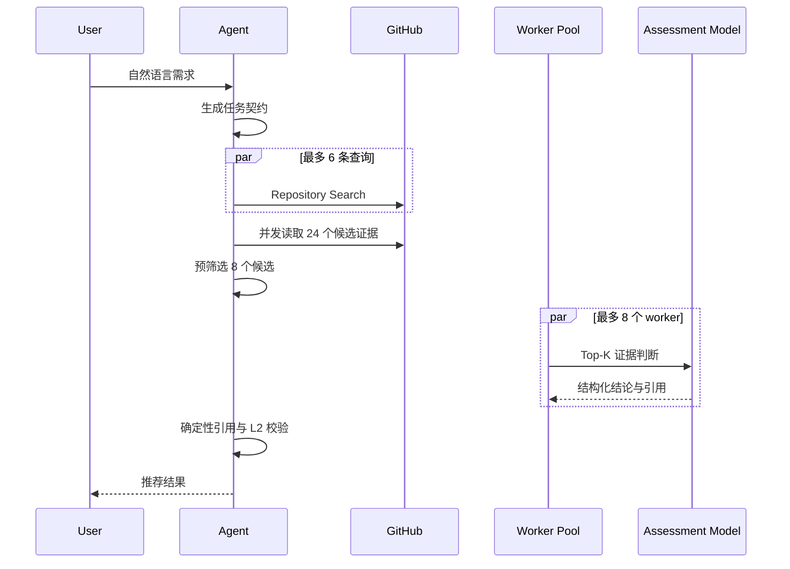

# RepoScoutAgent 性能优化 STAR 档案

> 长期维护约定：本文是项目性能工程的历史档案和简历素材来源，不应删除。
> 后续优化可以修订解释、补充数据和追加新版本，但必须保留历史基线、测试条件、失败方案与质量护栏，不能只保留最新最好看的数字。

最后更新：2026-07-20

## 一页结论

RepoScoutAgent 的一次宽泛 GitHub 项目检索最初在 300 秒客户端预算内无法完成。通过节点级定位、候选漏斗、有界并行、模型分工、超时隔离和能力熔断，同一真实查询的一次观测从 `>300 秒` 降到 `100.6 秒` 并正常返回结果。按 300 秒保守下界计算，单请求端到端延迟至少降低 `66.5%`，完成速度至少提高 `2.98x`。

这不是严格的 A/B Benchmark：LLM 生成的查询与候选集合没有冻结，GitHub 是实时数据，最终测试可能命中了此前写入的仓库文档缓存，模型服务与网络负载也未固定。因此这组数字是可信的工程观察和优化线索，不能表述为 p50、p95 或吞吐量结论。

优化没有引入多 Agent。主流程继续由一个 Agent 维护任务目标和证据标准，仓库分析由无状态 worker 并行执行，避免 subagent 重复读取上下文、重复消耗 Token 和产生结论协调开销。

离线回归结果保持：

| 指标 | 优化后 |
|---|---:|
| Candidate Recall | 1.00 |
| Recall@24 | 1.00 |
| Recall@analysis | 1.00 |
| Citation Accuracy | 1.00 |
| 自动化测试 | 52 passed |
| 覆盖率 | 87.05% |

这些离线指标来自当前固定夹具，只用于防止已知回归，不代表公开 GitHub 全量数据上的泛化质量。

## 证据状态

### 本次真实测试中实际生效的能力

| 能力 | 已实现 | `100.6 秒`测试中生效 | 说明 |
|---|---:|---:|---|
| `60→24→8` 候选漏斗 | 是 | 是 | 8 个候选进入强模型判断 |
| 8 路动态 worker | 是 | 是 | 替代串行循环和固定分组 |
| 快速证据判断模型 | 是 | 是 | `gpt-5.4-mini` |
| 60 秒单仓库超时 | 是 | 是 | 防止单个请求无限拖延 |
| embedding 批处理 | 是 | 否 | 当前模型服务没有 embedding 模型 |
| embedding 内容缓存 | 是 | 否 | 本次没有成功生成 embedding |
| embedding 能力熔断 | 是 | 是 | 首次失败后停止逐仓库重试 |
| BM25 Top-K 降级 | 是 | 是 | 代替不可用的向量检索 |
| 确定性引用校验 | 是 | 是 | 校验原文、路径和 commit SHA |

因此，不能将 `100.6 秒` 的改善归因于 embedding 批处理或缓存。该次实测的主要有效因素是候选漏斗、动态并发、模型分工、超时隔离和 embedding 失败熔断。

### 当前测试的不可比因素

- 各轮 LLM 可能生成不同的 GitHub 查询。
- GitHub 搜索结果和仓库状态是实时变化的。
- 各轮发现、读取和分析的仓库集合没有冻结。
- `.cache/repository_documents/` 在后期测试中可能已经存在文档缓存。
- 模型服务和网络负载没有固定或记录。
- 当前只保留了单次真实结果，没有足够样本计算 p50/p95。
- 尚未记录各轮 Token、外部调用数量和缓存命中率。

## STAR

### Situation

系统需要将自然语言需求转换为多条 GitHub 查询，从最多 60 个仓库中选择候选，读取前 24 个仓库的 README、docs、manifest 和白名单源码，再逐项完成 L1 文档证据和 L2 静态实现验证。

最初实现对最多 24 个仓库串行执行证据检索和 LLM 判断。一次宽泛请求大致包含：

```text
1 次强 LLM 任务契约生成
最多 6 次 GitHub Search
最多 24 个仓库的文档读取
最多约 48 次独立 embedding 请求
最多 24 次串行 LLM 仓库判断
```

真实测试中，查询在 300 秒后仍未返回。页面虽然能展示粗粒度进度，但用户会将长时间等待误认为 GitHub 或服务断连。

### Task

在不降低证据可信度、不突破 L2 安全边界、不执行候选仓库代码的前提下：

1. 显著缩短端到端搜索时间。
2. 防止单个慢模型请求拖住整轮任务。
3. 减少重复 embedding 和无价值的强模型调用。
4. 保留候选路线多样性，避免只追逐预评分最高的一类项目。
5. 用回归指标证明加速没有直接破坏现有召回和引用正确性。

### Action

#### 1. 先定位而不是盲目增加并发

通过 SSE 节点进度对真实请求分段观察：

```text
需求理解与查询生成       约 27 秒
GitHub 搜索与仓库重排     约 6 秒
文档读取与证据准备        累计约 54 秒
剩余主要耗时             仓库级 LLM 判断
```

这证明 GitHub 不是主要长尾来源，继续增加 GitHub 并发不会解决核心问题。

#### 2. 构建候选漏斗

保留分层处理：

```text
最多 60 个 GitHub 候选
→ 仓库级重排后读取 24 个
→ 文档证据预筛选后判断 8 个
```

预筛选综合：

- 原子成功标准的术语覆盖率；
- 仓库级语义或确定性重排分数；
- 源码实现文件信号；
- 搜索假设来源多样性。

当前 8 个名额中保留 2 个探索位置，避免 Top-K 全部来自同一种搜索假设。

#### 3. 用动态 worker 代替 subagent

将逐仓库串行循环改为共享模型客户端的动态 worker 队列：

- 默认并发上限为 8；
- 一个 worker 只处理一个仓库；
- 单仓库失败不影响其他仓库；
- 快任务完成后立即领取下一个候选，避免固定分组的队头阻塞；
- worker 不拥有独立目标、记忆或规划能力，因此不会产生多 Agent 协调成本。

#### 4. 强模型与快速模型分工

- `gpt-5.5`：生成开放式任务契约、成功标准和搜索假设；
- `gpt-5.4-mini`：执行证据受限的结构化仓库判断；
- 确定性代码：验证引用原文、路径、commit SHA 和 L2 证据强度。

模型分工保留了开放式理解能力，同时避免为每个仓库重复调用最慢的强模型。

#### 5. 超时隔离与降级

每个仓库的 LLM 判断设置 60 秒上限。超时后只降级该仓库的判断，不阻塞整轮任务。降级状态会进入 warnings，不能静默伪装成完整模型结论。

#### 6. 批量 embedding 与内容缓存

- 跨仓库收集 chunk 和 requirement query views；
- 按批次调用 embedding 服务；
- 使用 `embedding model + content SHA-256` 作为进程内缓存键；
- 相同内容的后续请求不再重复编码。

#### 7. embedding 能力探测和整轮熔断

当前配置的模型服务没有提供 embedding 模型。旧流程会在仓库重排失败后，对每个仓库继续重复请求 embedding，产生多次 `InternalServerError` 和额外等待。

新流程在仓库级 embedding 首次失败后标记该轮能力不可用：

```text
semantic reranking failed
→ deterministic repository ranking
→ BM25 Top-K evidence retrieval
→ 不再逐仓库重试 embedding
```

降级仍只给模型提供 Top-K 证据，不退回无界完整文档上下文。

#### 8. 质量回归按阶段归因

评测分别计算：

- Candidate Recall；
- Recall@24；
- NDCG@24；
- Recall@analysis；
- 未召回仓库；
- 文档读取前丢失仓库；
- 证据预筛选前后丢失仓库；
- Citation Accuracy。

评测曾错误地将“没有可读取文档而被提前拒绝”的仓库归因于 `24→8` 预筛选。修复后，`Recall@analysis` 的分母只包含成功进入文档候选集的相关仓库，使性能阶段归因与真实处理边界一致。

### Result

使用同一真实请求进行阶段性对照：

```text
我想学习现代 RAG 检索技术，找核心检索实现清晰、有评测代码和架构文档的
Python GitHub 项目；不要只推荐封装型应用。
```

| 版本 | 主要变化 | 单次端到端结果 |
|---|---|---:|
| 原始版本 | 最多 24 个仓库串行判断 | `>300 秒`，客户端超时 |
| 并行初版 | 24→12、4 路固定分组、批量 embedding | 仍 `>300 秒` |
| 快速模型版 | 8 个候选、动态并发、`gpt-5.4-mini` | `161.6 秒` |
| 熔断优化版 | 8 路 worker、60 秒隔离、embedding 整轮熔断 | `100.6 秒`，返回 7 个结果 |

以 300 秒作为原始版本的保守下界：

```text
耗时降低至少：(300 - 100.6) / 300 = 66.5%
速度改善至少：300 / 100.6 = 2.98x
```

由于原始版本实际耗时超过 300 秒，真实改善幅度可能更高，但没有完整结束时间，因此简历和文档只能使用“至少”表述。

同时，由于缓存状态、查询计划和候选集合没有冻结，这个比例只能作为工程观察。正式简历数字应在完成下文的可复现基准后更新；在此之前，面试中必须主动说明测量边界。

## 性能架构





## 简历表述参考

### 一句话版本

针对 GitHub RAG Agent 的多阶段检索长尾，设计候选漏斗、8 路动态 worker、模型级联、embedding 缓存与能力熔断，将同一真实请求的端到端耗时从超过 300 秒降至 100.6 秒，至少降低 66.5%，同时保持固定评测集 Recall@analysis 和 Citation Accuracy 为 1.00。

### 三条版本

- 使用 SSE 节点级观测定位 24 次串行 LLM 仓库判断为主要长尾，而非盲目增加 GitHub 并发。
- 设计 `60→24→8` 候选漏斗、带探索配额的预筛选、8 路动态 worker、强弱模型分工和单仓库超时隔离，将真实端到端耗时降低至少 66.5%。
- 实现跨仓库 embedding 批处理、内容 hash 缓存和服务能力熔断，并用分阶段 Recall、NDCG 与引用准确率回归约束性能优化的质量风险。

## 面试追问边界

### 为什么没有使用 subagent？

瓶颈是独立仓库的同构网络调用。subagent 会重复传递任务上下文、读取相同证据并增加结论协调调用；无状态 worker 可以获得相同并行度，同时更容易控制并发、超时、成本和引用责任。

### 为什么不是直接把并发调到 24？

模型服务可能限流或内部排队。无界并发会增加失败率和长尾，并可能让所有请求同时超时。当前上限 8 与强模型候选数一致，后续应根据真实 p95 和服务配额调整。

### 为什么允许 BM25 降级？

当前模型服务没有 embedding 能力。BM25 对命令、库名、配置键和源码符号可靠，并且比反复调用不可用的 embedding 服务更快、更可解释。系统会明确告警，不能把降级结果描述成语义检索。

### `100.6 秒` 是否具有统计意义？

目前是固定环境中的单次真实对照，只能证明该次请求从超时变为可完成，不能代表 p50 或 p95。正式性能结论需要固定候选快照或记录外部 API 响应，并至少运行多次。

### 是否证明吞吐量提高了 2.98 倍？

没有。`2.98x` 是按单请求端到端延迟计算的最低完成速度提升。吞吐量需要在固定并发用户数、模型限流和请求成功率条件下单独压测。

## 正式基准协议

### 固定条件

每次正式对比必须记录或冻结：

```text
commit SHA
数据集版本
完整用户请求
LLM 生成的任务契约和查询
GitHub 候选响应快照
仓库文档与 commit SHA 快照
模型名称与服务端点标识
Python 版本
并发、超时和候选预算
冷缓存或热缓存
检索模式与降级状态
```

### 运行矩阵

至少覆盖：

| 维度 | 取值 |
|---|---|
| 请求宽度 | 具体、中等、宽泛 |
| 缓存状态 | 冷缓存、热缓存 |
| embedding | 可用、不可用熔断 |
| 分析预算 | 6、8、12、24 |
| 每组次数 | 至少 10 次 |

### 必须采集的性能指标

- TTFC：首次候选出现时间；
- TTFV：首次完成证据验证的结果时间；
- 端到端延迟的 p50、p95、最小值和最大值；
- 成功率、超时率和规则降级率；
- GitHub、embedding 和 LLM 调用次数；
- 输入 Token、输出 Token 和估算成本；
- embedding 缓存命中率与文档缓存命中率；
- 实际峰值并发和 429/5xx 数量。

### 质量与速度 Pareto

正式报告必须同时填写，不能只选最快配置：

| 分析候选数 | 延迟 p50 | 延迟 p95 | Recall@analysis | Success@5 | NDCG@5 | Citation Accuracy |
|---:|---:|---:|---:|---:|---:|---:|
| 24 | 待测 | 待测 | 待测 | 待测 | 待测 | 待测 |
| 12 | 待测 | 待测 | 待测 | 待测 | 待测 | 待测 |
| 8 | 待测 | 待测 | 待测 | 待测 | 待测 | 待测 |
| 6 | 待测 | 待测 | 待测 | 待测 | 待测 | 待测 |

### 回滚门槛

- `Citation Accuracy < 1.00`：阻止合并并检查证据边界；
- `Recall@analysis < 0.98`：不得继续缩减候选预算；
- 强模型超时或规则降级率 `>20%`：降低并发、切换模型或恢复更长超时；
- 429/5xx 相比基线显著增加：回退并发配置；
- Success@5 或 NDCG@5 出现统计上稳定的下降：撤销对应加速策略；
- 测试条件不等价或样本不足：结果只能标记为观察，不进入正式简历数字。

## 后续更新协议

每次性能优化必须在本文追加一条记录，至少包含：

1. 日期、代码版本或 commit。
2. 测试请求和环境。
3. 候选数量与并发配置。
4. 模型、检索模式和是否发生降级。
5. TTFC、TTFV、端到端 p50/p95；样本不足时明确写“单次”。
6. GitHub、embedding 和 LLM 调用数量。
7. Candidate Recall、Recall@analysis、Success@5、NDCG@5 和 Citation Accuracy。
8. 与上个版本相比的改善和回退。

历史数据只能追加勘误说明，不能删除或用新结果覆盖。若测试条件变化，必须新增一行，不能直接比较不等价数据。

## 性能记录模板

```text
日期：
commit：
变更：
请求/数据集：
候选快照：
模型与检索模式：
并发/超时/候选预算：
缓存状态：
运行次数：
TTFC / TTFV：
端到端 min / p50 / p95 / max：
调用数 / Token / 成本：
降级与错误：
Recall@analysis / Success@5 / NDCG@5 / Citation Accuracy：
相对上版变化：
结论与是否保留：
```

## 下一阶段

- 增加结构化节点耗时、调用数、Token 和 trace ID。
- 建立同一真实请求至少 10 次的 p50/p95 基线。
- 页面先展示重排后的暂定候选，再逐仓库更新 verified 状态。
- 在支持 embedding 的服务上测批量缓存命中率和真实语义重排增益。
- 为多轮对话复用上一轮候选、文档与判断缓存。
- 在质量评测证明安全后，尝试每次 2–3 个仓库的小批量结构化判断。
